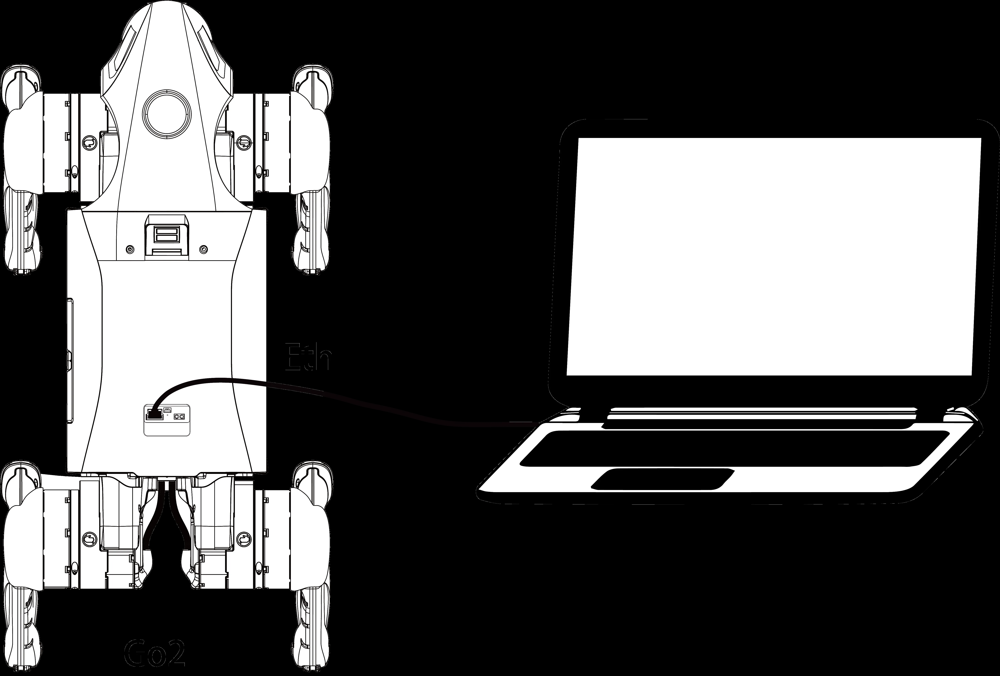

# 连接宇树Go2 开发版（EDU版）的扩展坞进行二次开发

# 连接宇树Go2 开发版（EDU版）的扩展坞进行二 次开发

速览：连接宇树（Unitree）Go2开发版（EDU版）的扩展坞进行二次开发，主要分为物理连 接、网络配置和远程登录三个核心环节。也即：网线直连扩展坞RJ45 → 设置静态IP (192.168.123.x/24) → SSH登录扩展坞(192.168.123.18) → 安装SDK与依赖 → 运行测试 demo。

由于Go2的扩展坞通常内置了高性能计算模块（如NVIDIA Orin NX/Nano），开发者需要通 过以太网（有线）方式与该模块建立稳定通信。



## 准备工作

|项目|规格 / 说明|
|---|---|
|||

1

<!-- Page 2 -->

|Col1|Col2|
|---|---|
|笔记本电脑|推荐 Ubuntu 20.04/22.04系统 ，但<br>Windows/Mac也可，Ubuntu兼容性最佳|
|网络线|千兆网线 (连接笔记本与扩展坞 RJ45接口)|
|软件|SSH客户端、文本编辑器 (vim、VS Code)|
|工具|Git、CMake、C++编译器、Python3 (>=3.8)|
|扩展坞信息|默认 IP:192.168.123.18，用户名: unitree，密码: <br>123|

## 第一步：物理连接

1. 设备关机：确保机器狗处于关机状态，放置在平稳支撑台上。
2. 准备线缆：准备一根超五类（Cat5e）或六类（Cat6）网线。如果你的笔记本电脑没有网

口，需要准备一个 USB转千兆网口转接器。

3. 插入接口：将网线一端接入笔记本电脑，另一端接入Go2背部扩展坞上的 RJ45以太网

口。

(可选)如需直接操作扩展坞：

- 用Type-C转HDMI线连接扩展坞Type-C全功能接口与显示器。
- 用USB线连接键盘鼠标到扩展坞USB接口。
4. 启动机器狗：按下电源键，等待扩展坞系统完全启动(约30秒)。扩展坞上的指示灯应当亮

起，表示计算模块已在运行。

## 第二步：配置笔记本电脑网络

Go2内部采用固定IP地址段（通常为 192.168.123.x）。为了能访问机器狗，你必须手动 设置笔记本的IP地址。

对于本地是Windows系统用户：

1. 打开 控制面板>网络和共享中心>更改适配器设置。
2. 右键点击对应的“以太网”连接，选择 属性。
3. 双击 Internet协议版本4 (TCP/IPv4)。
4. 选择“使用下面的IP地址”，按如下填写：

IP地址：192.168.123.222（末位可以是除1、18、20、161以外的2-254之间

- 

2

<!-- Page 3 -->

的数字） 子网掩码：255.255.255.0

- 

默认网关：可不填

- 
5. 点击“确定”保存。

对于本地是Linux (Ubuntu)系统用户（以下是针对图形化界面系统）：

1. 打开设置 → 网络 → 有线连接(已连接的那个)→ 点击设置图标
2. 选择IPv4标签，设置为手动模式，填写以下信息：

地址：192.168.123.xxx(xxx范围: 1-254，避开18和255)

- 

子网掩码：255.255.255.0

- 

网关：留空(或填写192.168.123.1)

- 

DNS：留空(或填写8.8.8.8)

- 
3. 点击应用保存设置

## 第三步：连通性测试

打开你电脑上的终端（Windows推荐使用PowerShell或CMD，Linux使用Terminal），输入 以下命令检查是否能“看到”扩展坞：

Bash # 测试与扩展坞计算模块的连接 1 ping 192.168.123.18 2 注意：

```
192. 168.123.18 是扩展坞（Orin模块）的默认IP。
```

- 

```
192. 168.123.161 是机器狗主控（运动控制）的默认IP。 如果能看到数据包回复
```

- 

（Reply），说明链路已通。

## 第四步：通过SSH远程登录

开发工作通常在扩展坞的Ubuntu系统内进行。

在终端输入以下登录命令：

3

<!-- Page 4 -->

Bash ssh unitree@192.168.123.18 1

```
1. 输入密码：默认密码通常为 123。
2. 成功标志：终端提示符变为 unitree@ubuntu:~$，表示你已成功进入扩展坞的开发环
```

境。

## 第五步：开发环境准备

登录后，你可以开始调用Unitree SDK或ROS2接口：

SDK路径：通常在 ~/Unitree/sdk 目录下。

- 

ROS2环境变量：

- 

Bash source /opt/ros/foxy/setup.bash 1 export RMW_IMPLEMENTATION=rmw_cyclonedds_cpp 2 重要提示：在进行运动控制代码调试前，务必先通过App将机器狗切换到 “调试模式” 或 “挂起状态”（吊起测试），防止程序错误导致机器狗失控冲撞。

- 

## 第六步：安装GO2开发SDK

1. 在扩展坞上下载官方SDK：

Bash cd ~ 1 git clone https://github.com/unitreerobotics/unitree_sdk2.git 2

2. 安装依赖：

Bash cd unitree_sdk2 1 sudo apt install -y libboost-all-dev libeigen3-dev libyaml-cpp-dev 2

3. 编译SDK：

4

<!-- Page 5 -->

Bash mkdir build && cd build 1 cmake ..

2 make -j$(nproc) 3

4. (可选)在笔记本本地也安装SDK (如需本地开发)：

重复上述步骤在笔记本上执行

- 

确保笔记本与扩展坞网络互通

- 

## 七、测试连接(运行示例程序)

1. 在扩展坞上运行SDK示例：

Bash cd ~/unitree_sdk2/build/example/walk 1 ./walk 2 机器狗应能执行行走动作(确保周围无障碍物)

2. 远程控制测试(笔记本→扩展坞)：

在笔记本上编写简单控制程序，通过网络发送指令到扩展坞

- 

或使用ROS2进行更复杂的开发(扩展坞预装ROS2 Humble)

- 

## 八、高级连接方式(可选)

1. Wi-Fi连接(替代网线)
1. 扩展坞连接Wi-Fi：

Bash nmcli device wifi connect "SSID" password "密码" 1

2. 查看扩展坞Wi-Fi IP：

|Bash|Col2|
|---|---|
|||
|`1`|`ip addr show wlan0`|
|||

3. 笔记本连接同一Wi-Fi，使用新IP进行SSH登录

5

<!-- Page 6 -->

2. VS Code远程开发
1. 在笔记本安装VS Code和"Remote - SSH"扩展
2. 按F1→ 输入"Remote-SSH: Connect to Host..."

```
3. 输入unitree@192.168.123.18，按提示操作
```

4. 成功连接后，可直接在VS Code中编辑扩展坞上的代码并调试

## 九、常见问题排查

|问题|解决方案|
|---|---|
|无法 ping通扩展坞|1.检查网线是否插好2.确认笔记本 IP设置正确<br>(192.168.123.x)3.重启扩展坞和笔记本网络|
|SSH登录失败|1.确认扩展坞 IP和密码正确2.检查防火墙设置<br>(sudo ufw disable)3.重启 SSH服务 (sudo<br>systemctl restart ssh)|
|SDK编译失败|1.安装所有依赖2.确保 CMake版本≥3.103.删<br>除 build目录重新编译|
|程序无法控制机器狗|1.确认机器狗已启动且无错误2.检查 SDK版本与<br>固件版本匹配3.以 root权限运行程序 (sudo)|

6
