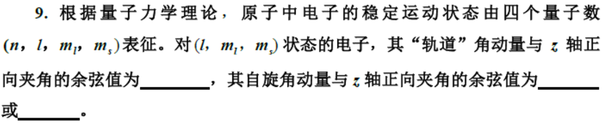

这个问题涉及到一个典型的电磁学积分计算，通常出现在计算一段圆弧形导线（如半圆环）在通电长直导线产生的磁场中运动时产生的**动生电动势（Motional EMF）**。

公式中的物理量含义推测如下：
*   $\frac{\mu_0 I}{2\pi(r + R\cos\theta)}$：这是距离长直导线 $(r + R\cos\theta)$ 处的磁感应强度 $B$ 的大小。
*   $v$：导线的运动速度。
*   $\cos\theta$：来自于 $\vec{E}_k \cdot d\vec{l}$ 的点积，表示速度方向或路径切向与电场方向的夹角投影。
*   $dl$：积分路径微元。
*   几何结构：一个半径为 $R$ 的圆弧，其圆心距离长直导线为 $r$。

---

### **完整计算步骤**

我们需要计算的积分是：
$$ \varepsilon_{QP} = \int \frac{\mu_0 I v}{2\pi(r + R\cos\theta)} \cdot \cos\theta \cdot dl $$

#### **第1步：确定积分变量关系**
由于被积函数中含有 $\cos\theta$，且路径是圆弧，我们利用圆的弧长公式将 $dl$ 转换为角度 $d\theta$。
对于半径为 $R$ 的圆弧：
$$ dl = R \cdot d\theta $$

将 $dl$ 代入原式，并把常数项 $\frac{\mu_0 I v}{2\pi}$ 提取到积分号外面：
$$ \varepsilon_{QP} = \frac{\mu_0 I v}{2\pi} \int \frac{\cos\theta}{r + R\cos\theta} \cdot (R \, d\theta) $$
整理得：
$$ \varepsilon_{QP} = \frac{\mu_0 I v R}{2\pi} \int \frac{\cos\theta}{r + R\cos\theta} \, d\theta $$

#### **第2步：被积函数的代数变形（关键步骤）**
我们需要计算核心积分 $I_{core} = \int \frac{\cos\theta}{r + R\cos\theta} \, d\theta$。
为了求解这个积分，我们需要对分子进行凑项，使其包含分母的形式。

利用恒等变形：$\cos\theta = \frac{1}{R}(R\cos\theta) = \frac{1}{R}(r + R\cos\theta - r)$

代入积分中：
$$ \frac{\cos\theta}{r + R\cos\theta} = \frac{1}{R} \cdot \frac{r + R\cos\theta - r}{r + R\cos\theta} $$
$$ = \frac{1}{R} \left( \frac{r + R\cos\theta}{r + R\cos\theta} - \frac{r}{r + R\cos\theta} \right) $$
$$ = \frac{1}{R} \left( 1 - \frac{r}{r + R\cos\theta} \right) $$

#### **第3步：拆分积分**
将变形后的式子代回电动势表达式：
$$ \varepsilon_{QP} = \frac{\mu_0 I v R}{2\pi} \int \frac{1}{R} \left( 1 - \frac{r}{r + R\cos\theta} \right) \, d\theta $$

消去外面的 $R$ 和里面的 $\frac{1}{R}$：
$$ \varepsilon_{QP} = \frac{\mu_0 I v}{2\pi} \left[ \int d\theta - r \int \frac{1}{r + R\cos\theta} \, d\theta \right] $$

现在我们有两个积分要算：
1.  **第一项**：$\int d\theta = \theta$
2.  **第二项**：$\int \frac{1}{r + R\cos\theta} \, d\theta$

#### **第4步：计算标准积分 $\int \frac{1}{r + R\cos\theta} \, d\theta$**
这是一个标准的微积分积分形式。假设 $r > R$（圆环不包含长直导线），可以使用**万能代换**（Weierstrass substitution）：
令 $t = \tan(\frac{\theta}{2})$，则 $d\theta = \frac{2dt}{1+t^2}$，$\cos\theta = \frac{1-t^2}{1+t^2}$。

代入后经过推导（查积分表可知），该不定积分的结果为：
$$ \int \frac{1}{r + R\cos\theta} \, d\theta = \frac{2}{\sqrt{r^2 - R^2}} \arctan\left( \sqrt{\frac{r-R}{r+R}} \tan\frac{\theta}{2} \right) $$

#### **第5步：综合结果**
将上述结果组合起来，电动势的不定积分表达式为：
$$ \varepsilon_{QP} = \frac{\mu_0 I v}{2\pi} \left[ \theta - r \cdot \frac{2}{\sqrt{r^2 - R^2}} \arctan\left( \sqrt{\frac{r-R}{r+R}} \tan\frac{\theta}{2} \right) \right] \Bigg|_{\theta_{start}}^{\theta_{end}} $$

---

### **示例：如果是半圆（$-\frac{\pi}{2}$ 到 $\frac{\pi}{2}$）**
如果物理问题是计算半圆环（从 $-\pi/2$ 到 $\pi/2$）的电动势，我们代入上下限：

1.  **第一项**：$\theta \big|_{-\pi/2}^{\pi/2} = \frac{\pi}{2} - (-\frac{\pi}{2}) = \pi$
2.  **第二项**：
    当 $\theta = \pm \frac{\pi}{2}$ 时，$\tan(\frac{\theta}{2}) = \tan(\pm \frac{\pi}{4}) = \pm 1$。
    积分值为：
    $$ \frac{2}{\sqrt{r^2 - R^2}} \left[ \arctan\left(\sqrt{\frac{r-R}{r+R}}\right) - \arctan\left(-\sqrt{\frac{r-R}{r+R}}\right) \right] $$
    $$ = \frac{4}{\sqrt{r^2 - R^2}} \arctan\left(\sqrt{\frac{r-R}{r+R}}\right) $$
    
    *利用数学恒等式 $2\arctan x = \arccos \frac{1-x^2}{1+x^2}$，该项可以简化为 $\frac{2}{\sqrt{r^2 - R^2}} \arccos(\frac{R}{r})$。*

**最终半圆的电动势公式通常为：**
$$ \varepsilon_{QP} = \frac{\mu_0 I v}{2\pi} \left[ \pi - \frac{2r}{\sqrt{r^2 - R^2}} \arccos\left(\frac{R}{r}\right) \right] $$
*(注：具体正负号和形式取决于题目的坐标系定义和积分方向)*

***

**答案：** [ A ]

**解析：**

要解答这个问题，我们需要理解“拍（Beat）”现象的原理以及附加质量对音叉频率的影响。

1.  **拍的周期与频率差的关系：**
    *   **拍频率 ($f_{beat}$)** 等于两个声波频率之差的绝对值：$f_{beat} = |f_1 - f_2|$。
    *   **拍周期 ($T$)** 是拍频率的倒数：$T = \frac{1}{f_{beat}} = \frac{1}{|f_1 - f_2|}$。
    *   题目问的是哪种情况**“拍的周期最长”**。根据公式，要使周期 $T$ 最大，分母（频率差 $|f_1 - f_2|$）必须**最小**。也就是说，带套环音叉的频率必须**最接近**原来不带套环音叉的频率。

2.  **套环对音叉频率的影响：**
    *   音叉臂可以看作是悬臂梁。给振动系统增加质量（套环）会增加惯性，从而导致系统的固有频率**降低**。
    *   两个音叉原本一模一样，频率相同。加上套环后，该音叉的频率会变小。
    *   频率降低的幅度取决于套环的位置：
        *   **音叉臂顶端（自由端）**：振动幅度最大，速度最大。在此处增加质量对系统动能和惯性的影响最大，因此会导致频率**下降最多**。
        *   **音叉臂底部（固定端）**：振动幅度极小（接近节点）。在此处增加质量对系统的振动几乎没有影响，因此频率**下降最少**，变化极其微弱。

3.  **综合分析四个选项：**
    *   **图 (D)**：套环在最顶端。对振动阻碍最大，频率下降最多，与原频率的差值 $\Delta f$ 最大，因此拍频最高，**拍周期最短**。
    *   **图 (C) 和 (B)**：套环位置逐渐降低，频率变化幅度逐渐减小，频率差减小，拍周期变长。
    *   **图 (A)**：套环在最底端（靠近根部）。此处振动幅度极小，套环的存在对频率的影响最小。此时带套环音叉的频率**最接近**原音叉的频率，两者的频率差 $|f_1 - f_2|$ **最小**。
    *   根据 $T = \frac{1}{\text{最小的频率差}}$，此时得到的**拍周期最长**。

综上所述，套环位置越低，对频率影响越小，频率差越小，拍的周期越长。

**故选 A。**

***

这是一个基于**迈克尔逊干涉仪（Michelson Interferometer）**原理的物理计算题。题目要求计算反射镜 $M_2$ 在整个过程中转过的总角度。

下面我为你详细拆解这个解题过程：

### 1. 物理过程分析

这个过程描述了迈克尔逊干涉仪中反射镜 $M_2$ 从倾斜到平行，再到反向倾斜的过程：

1.  **初始状态（直线条纹）**：
    *   $M_1$ 与 $M_2'$（$M_2$ 的虚像）不平行，它们之间形成一个**楔形空气膜**（Air Wedge）。
    *   此时发生的是**等厚干涉**，表现为**直线状干涉条纹**。
    *   此时楔角为 $\theta_1$，条纹数为 $N_1$。

2.  **中间状态（同心圆环）**：
    *   转动过程中，条纹突然变为同心圆环。这意味着 $M_1$ 与 $M_2'$ 变得**平行**了。
    *   此时发生的是**等倾干涉**。这是一个关键的“零点”，说明镜子转过了水平位置。

3.  **最终状态（直线条纹）**：
    *   继续同方向转动，$M_1$ 与 $M_2'$ 再次形成楔形，但倾斜方向与初始状态相反。
    *   再次出现**直线状干涉条纹**。
    *   此时楔角为 $\theta_2$，条纹数为 $N_2$。

**结论**：镜子 $M_2$ 的总转动角度 $\Delta\theta$ 等于初始倾角 $\theta_1$ 加上最终倾角 $\theta_2$，即 $\Delta\theta = \theta_1 + \theta_2$。

---

### 2. 核心公式推导

我们需要建立**条纹数量**与**楔角（镜子倾角）**之间的关系。

1.  **相邻明纹的高度差**：
    对于等厚干涉（空气劈尖），光程差 $\delta = 2d + \frac{\lambda}{2}$（$\lambda/2$是半波损失，这里不影响间距计算）。
    相邻两级明纹（$k$ 和 $k+1$）对应的空气膜厚度差 $\Delta d$ 满足：
    $$2 \cdot \Delta d = \lambda \Rightarrow \Delta d = \frac{\lambda}{2}$$
    即：每增加一条条纹，空气楔的厚度就增加半个波长。

2.  **计算楔形的高度 $H$**：
    在宽度 $L$ 的范围内，我们看到了 $N$ 条完整的条纹。
    这意味着在长度 $L$ 上，有 $N-1$ 个条纹间距。
    因此，空气楔两端的高度差 $H$ 为：
    $$H = (N - 1) \cdot \Delta d = (N - 1) \cdot \frac{\lambda}{2}$$

3.  **计算楔角 $\theta$**：
    由于角度很小，$\tan\theta \approx \theta$。
    根据几何关系（右下角的绿色三角形）：
    $$\theta = \frac{H}{L}$$
    代入 $H$ 的表达式：
    $$\theta = \frac{(N - 1)\lambda}{2L}$$

---

### 3. 计算总转动角度

现在我们将上述公式应用到两个阶段：

*   **第一阶段（转动前）**：
    观测到 $N_1$ 条条纹，对应的倾角为：
    $$\theta_1 = \frac{(N_1 - 1)\lambda}{2L}$$

*   **第二阶段（转动后）**：
    观测到 $N_2$ 条条纹，对应的倾角为：
    $$\theta_2 = \frac{(N_2 - 1)\lambda}{2L}$$

*   **总角度 $\Delta\theta$**：
    因为是从一侧倾斜穿过平行位置转到另一侧倾斜，所以总角度是两者之和：
    $$\Delta\theta = \theta_1 + \theta_2$$
    $$\Delta\theta = \frac{(N_1 - 1)\lambda}{2L} + \frac{(N_2 - 1)\lambda}{2L}$$

    提取公因式 $\frac{\lambda}{2L}$ 并整理括号内的项：
    $$\Delta\theta = \frac{\lambda}{2L} (N_1 - 1 + N_2 - 1)$$
    $$\Delta\theta = \frac{(N_1 + N_2 - 2)\lambda}{2L}$$

### 总结

最终的公式解释为：
$$ \Delta\theta = \frac{(N_1 + N_2 - 2)\lambda}{2L} $$

*   $\lambda$：入射光波长。
*   $L$：观测区域的宽度。
*   $N_1, N_2$：起始和结束时观测到的完整条纹数。
*   减去的 $2$ 来自于两次计数中的首项间隔修正（即 $N$ 条纹对应 $N-1$ 个间距）。
*   

***

**答案**

1.  **第一空**：$\frac{m_l}{\sqrt{l(l+1)}}$
2.  **第二空**：$\frac{\sqrt{3}}{3}$ （或 $\frac{1}{\sqrt{3}}$）
3.  **第三空**：$-\frac{\sqrt{3}}{3}$ （或 $-\frac{1}{\sqrt{3}}$）

---

### **解析**

这道题考察的是量子力学中角动量的空间量子化（Space Quantization）概念。我们需要利用角动量的大小公式和其在 $z$ 轴上的投影公式来计算夹角的余弦值。

#### **1. “轨道”角动量与 $z$ 轴的夹角**

*   **角动量的大小 ($|\vec{L}|$):**
    根据量子力学，轨道角动量的大小由角量子数 $l$ 决定，公式为：
    $$ |\vec{L}| = \sqrt{l(l+1)}\hbar $$
*   **角动量在 $z$ 轴的投影 ($L_z$):**
    角动量在 $z$ 轴上的分量由磁量子数 $m_l$ 决定，公式为：
    $$ L_z = m_l\hbar $$
*   **计算余弦值:**
    设轨道角动量与 $z$ 轴的夹角为 $\theta$，根据几何关系，投影等于大小乘以夹角的余弦：
    $$ L_z = |\vec{L}| \cdot \cos\theta $$
    所以：
    $$ \cos\theta = \frac{L_z}{|\vec{L}|} = \frac{m_l\hbar}{\sqrt{l(l+1)}\hbar} = \frac{m_l}{\sqrt{l(l+1)}} $$

#### **2. 自旋角动量与 $z$ 轴的夹角**

*   **自旋角动量的大小 ($|\vec{S}|$):**
    电子的自旋量子数 $s$ 是固定的，恒为 $1/2$（$s = 1/2$）。
    大小公式为：
    $$ |\vec{S}| = \sqrt{s(s+1)}\hbar = \sqrt{\frac{1}{2}\left(\frac{1}{2}+1\right)}\hbar = \sqrt{\frac{3}{4}}\hbar = \frac{\sqrt{3}}{2}\hbar $$
*   **自旋在 $z$ 轴的投影 ($S_z$):**
    自旋磁量子数 $m_s$ 有两个可能的取值：$+\frac{1}{2}$ 或 $-\frac{1}{2}$。
    投影公式为：
    $$ S_z = m_s\hbar = \pm\frac{1}{2}\hbar $$
*   **计算余弦值:**
    设自旋角动量与 $z$ 轴的夹角为 $\phi$。
    $$ \cos\phi = \frac{S_z}{|\vec{S}|} = \frac{\pm\frac{1}{2}\hbar}{\frac{\sqrt{3}}{2}\hbar} = \pm\frac{1}{\sqrt{3}} = \pm\frac{\sqrt{3}}{3} $$
    
    因此，自旋对应的余弦值有两个固定的可能值：一个是正的 $\frac{\sqrt{3}}{3}$，另一个是负的 $-\frac{\sqrt{3}}{3}$。

***

衍射的光强推导，薛定谔方程推导定态薛定谔方程， 无穷势井  波函数表达式和能量表达式，N个同方向同频率叠加。

---

### 第一部分：单缝衍射的光强公式推导

**目标公式：**
\[ I(\theta) = I_0 \left( \frac{\sin \alpha}{\alpha} \right)^2, \quad \text{其中 } \alpha = \frac{\pi a \sin \theta}{\lambda} \]

**详细证明：**

1.  **物理模型**：
    考虑宽度为 \(a\) 的单缝，有单色平面波（波长 \(\lambda\)）垂直入射。根据**惠更斯-菲涅耳原理**，缝上的每一点都可以看作是一个次级波源。

2.  **建立坐标系**：
    设缝沿 \(x\) 轴分布，范围从 \(-a/2\) 到 \(a/2\)。我们将缝分割成无数个宽度为 \(dx\) 的微元。
    设入射光振幅为 \(A_0\)，则单位长度的振幅为 \(A_0/a\)。微元 \(dx\) 发出的子波复振幅为：
    \[ dE_0 = \frac{A_0}{a} dx \]

3.  **相位差计算**：
    考虑衍射角为 \(\theta\) 的方向。位于 \(x\) 处的点波源发出的光，到达远处屏幕时，相对于中心点 \(x=0\) 的光程差为 \(\Delta L = x \sin \theta\)。
    对应的相位差 \(\phi\) 为：
    \[ \phi = k \Delta L = \frac{2\pi}{\lambda} x \sin \theta \]

4.  **积分求总振幅**：
    屏幕上某点的总复振幅 \(E(\theta)\) 是所有微元贡献的积分：
    \[ E(\theta) = \int_{-a/2}^{a/2} \frac{A_0}{a} e^{i \frac{2\pi}{\lambda} x \sin \theta} \, dx \]
    
    令 \(u = \frac{2\pi \sin \theta}{\lambda}\)，则积分变为：
    \[ E(\theta) = \frac{A_0}{a} \int_{-a/2}^{a/2} e^{i u x} \, dx = \frac{A_0}{a} \left[ \frac{e^{i u x}}{i u} \right]_{-a/2}^{a/2} \]
    \[ E(\theta) = \frac{A_0}{a} \frac{e^{i u a/2} - e^{-i u a/2}}{i u} \]
    
    利用欧拉公式 \(\sin \theta = \frac{e^{i\theta} - e^{-i\theta}}{2i}\)，上式化简为：
    \[ E(\theta) = \frac{A_0}{a} \frac{2i \sin(u a / 2)}{i u} = A_0 \frac{\sin(u a / 2)}{u a / 2} \]

5.  **代入参数**：
    将 \(u = \frac{2\pi \sin \theta}{\lambda}\) 代回，令 \(\alpha = \frac{u a}{2} = \frac{\pi a \sin \theta}{\lambda}\)，则：
    \[ E(\theta) = A_0 \frac{\sin \alpha}{\alpha} \]

6.  **光强公式**：
    光强 \(I\) 与振幅的模平方成正比（\(I \propto |E|^2\)）：
    \[ I(\theta) = |E(\theta)|^2 = I_0 \left( \frac{\sin \alpha}{\alpha} \right)^2 \]
    证毕。

---

### 第二部分：从含时薛定谔方程推导定态薛定谔方程

**目标公式：**
\[ \hat{H} \psi(x) = E \psi(x) \]
即 \(-\frac{\hbar^2}{2m} \frac{d^2 \psi}{dx^2} + V(x)\psi = E\psi\)

**详细推导：**

1.  **起始方程**：
    一维含时薛定谔方程为：
    \[ i\hbar \frac{\partial \Psi(x,t)}{\partial t} = -\frac{\hbar^2}{2m} \frac{\partial^2 \Psi(x,t)}{\partial x^2} + V(x,t)\Psi(x,t) \]

2.  **定态假设与分离变量**：
    假设势能 \(V\) 不随时间变化，即 \(V(x,t) = V(x)\)。此时可以使用**分离变量法**。
    设波函数解的形式为：
    \[ \Psi(x,t) = \psi(x) \cdot f(t) \]

3.  **代入方程**：
    将 \(\Psi = \psi f\) 代入原方程：
    \[ i\hbar \psi(x) \frac{df(t)}{dt} = f(t) \left[ -\frac{\hbar^2}{2m} \frac{d^2 \psi(x)}{dx^2} + V(x)\psi(x) \right] \]

4.  **分离变量**：
    等式两边同时除以 \(\psi(x)f(t)\)：
    \[ i\hbar \frac{1}{f(t)} \frac{df(t)}{dt} = \frac{1}{\psi(x)} \left[ -\frac{\hbar^2}{2m} \frac{d^2 \psi(x)}{dx^2} + V(x)\psi(x) \right] \]
    
    左边只与 \(t\) 有关，右边只与 \(x\) 有关。要使等式对任意 \(x, t\) 成立，两边必须等于同一个常数。我们将这个常数记为 \(E\)（即体系的总能量）。

5.  **分解为两个方程**：
    
    *   **时间部分**：
        \[ i\hbar \frac{1}{f} \frac{df}{dt} = E \implies \frac{df}{dt} = -\frac{iE}{\hbar} f \]
        解得：\(f(t) = e^{-iEt/\hbar}\)

    *   **空间部分（即定态薛定谔方程）**：
        \[ \frac{1}{\psi} \left[ -\frac{\hbar^2}{2m} \frac{d^2 \psi}{dx^2} + V(x)\psi \right] = E \]
        整理得：
        \[ -\frac{\hbar^2}{2m} \frac{d^2 \psi(x)}{dx^2} + V(x)\psi(x) = E\psi(x) \]
        或者写成算符形式：\(\hat{H}\psi = E\psi\)。
        证毕。

---

### 第三部分：一维无限深势井的波函数和能量

**势能定义**：
\[ V(x) = \begin{cases} 0 & 0 < x < a \\ \infty & \text{其他} \end{cases} \]

**详细推导：**

1.  **列出方程**：
    在势井内（\(0 < x < a\)），\(V(x)=0\)，定态方程为：
    \[ -\frac{\hbar^2}{2m} \frac{d^2 \psi}{dx^2} = E \psi \]
    令 \(k^2 = \frac{2mE}{\hbar^2}\)，方程化为简谐振动形式：
    \[ \frac{d^2 \psi}{dx^2} + k^2 \psi = 0 \]

2.  **通解**：
    \[ \psi(x) = A \sin(kx) + B \cos(kx) \]

3.  **应用边界条件**：
    由于势壁无限高，粒子不能穿透，波函数在边界处必须为0。
    *   **在 \(x=0\) 处**：
        \[ \psi(0) = A \cdot 0 + B \cdot 1 = 0 \implies B = 0 \]
        因此，\(\psi(x) = A \sin(kx)\)。
    *   **在 \(x=a\) 处**：
        \[ \psi(a) = A \sin(ka) = 0 \]
        由于 \(A \neq 0\)（否则没有粒子），必须有 \(\sin(ka) = 0\)。
        这意味着 \(ka = n\pi\)，其中 \(n = 1, 2, 3, \dots\)（\(n\)不能为0，否则波函数处处为0；不能为负，因为与正数解线性相关）。

4.  **能量本征值 \(E_n\)**：
    由 \(k = \frac{n\pi}{a}\) 和 \(k^2 = \frac{2mE}{\hbar^2}\) 联立：
    \[ \frac{2mE}{\hbar^2} = \frac{n^2 \pi^2}{a^2} \]
    解得：
    \[ E_n = \frac{n^2 \pi^2 \hbar^2}{2ma^2}, \quad n=1,2,3\dots \]

5.  **波函数归一化**：
    利用归一化条件 \(\int_{-\infty}^{\infty} |\psi(x)|^2 dx = 1\)：
    \[ \int_0^a A^2 \sin^2\left(\frac{n\pi x}{a}\right) dx = 1 \]
    利用积分公式 \(\int \sin^2(cx) dx = \frac{x}{2} - \frac{\sin(2cx)}{4c}\)：
    \[ A^2 \left[ \frac{x}{2} - \frac{\sin(2n\pi x/a)}{4n\pi/a} \right]_0^a = A^2 \left( \frac{a}{2} - 0 \right) = 1 \]
    \[ A^2 \frac{a}{2} = 1 \implies A = \sqrt{\frac{2}{a}} \]

    **最终波函数**：
    \[ \psi_n(x) = \sqrt{\frac{2}{a}} \sin\left(\frac{n\pi x}{a}\right) \]

---

### 第四部分：N个同方向同频率波的叠加（及其对前述公式的证明联系）

这一部分我们推导 **N个等幅、同频、同向且相位差恒定的波的叠加**。这正是**多缝干涉（光栅）**的基础，而当 \(N \to \infty\) 时，这就变成了**单缝衍射**（第一部分的积分形式）。

**目标公式（N个波叠加）：**
\[ I = I_0 \frac{\sin^2(N \delta / 2)}{\sin^2(\delta / 2)} \]
其中 \(\delta\) 是相邻两个波的相位差。

**详细证明：**

1.  **复振幅表示**：
    设第 \(j\) 个波的复振幅为 \(E_j\)。它们频率相同（\(\omega\)）、振幅相同（\(A_0\)）、传播方向相同，且相邻两个波的相位差为 \(\delta\)。
    \[ E_j = A_0 e^{i[-( \omega t - kx) + j\delta]} \]
    为了简化，忽略时间项和空间基准项，只看相位部分：
    \[ E_j = A_0 e^{i j \delta}, \quad j = 0, 1, \dots, N-1 \]

2.  **求和（振幅叠加）**：
    总振幅 \(E\) 为等比数列求和：
    \[ E = \sum_{j=0}^{N-1} A_0 e^{i j \delta} = A_0 (1 + e^{i\delta} + e^{i2\delta} + \dots + e^{i(N-1)\delta}) \]
    利用等比数列求和公式 \(S_N = a_1 \frac{1-q^N}{1-q}\)：
    \[ E = A_0 \frac{1 - e^{i N \delta}}{1 - e^{i \delta}} \]

3.  **化简复数形式**：
    利用技巧 \(1 - e^{i\theta} = e^{i\theta/2}(e^{-i\theta/2} - e^{i\theta/2}) = e^{i\theta/2}(-2i \sin(\theta/2))\)：
    \[ E = A_0 \frac{e^{i N \delta / 2} (-2i \sin(N \delta / 2))}{e^{i \delta / 2} (-2i \sin(\delta / 2))} \]
    \[ E = A_0 e^{i(N-1)\delta/2} \frac{\sin(N \delta / 2)}{\sin(\delta / 2)} \]

4.  **强度计算**：
    强度 \(I = |E|^2\)：
    \[ I = |A_0|^2 \left| \frac{\sin(N \delta / 2)}{\sin(\delta / 2)} \right|^2 \]
    令 \(I_{single} = |A_0|^2\) 为单个波的强度，则：
    \[ I = I_{single} \frac{\sin^2(N \delta / 2)}{\sin^2(\delta / 2)} \]

**如何用这个公式证明单缝衍射公式（第一部分）？**

这是从离散叠加到连续积分的过渡证明：

1.  **设定极限条件**：
    将单缝看作是由 \(N\) 个微元组成的，总宽度为 \(a\)。
    当 \(N \to \infty\) 时，每个微元的宽度 \(\Delta x \to 0\)。
    
2.  **相位差对应**：
    总相位差（缝的两端）为 \(\Phi = \frac{2\pi a \sin \theta}{\lambda} = 2\alpha\)。
    相邻微元的相位差 \(\delta = \frac{\Phi}{N} = \frac{2\alpha}{N}\)。

3.  **振幅对应**：
    设总入射光振幅为 \(A_{total}\)，则每个微元的振幅 \(A_0 = \frac{A_{total}}{N}\)。

4.  **取极限**：
    代入N波叠加公式：
    \[ E \propto \lim_{N \to \infty} \left( \frac{A_{total}}{N} \right) \frac{\sin(N \cdot \frac{2\alpha}{2N})}{\sin(\frac{2\alpha}{2N})} \]
    \[ E \propto A_{total} \lim_{N \to \infty} \frac{1}{N} \frac{\sin(\alpha)}{\sin(\alpha/N)} \]
    
    利用小角度近似，当 \(N \to \infty\) 时，\(\sin(\alpha/N) \approx \alpha/N\)：
    \[ E \propto A_{total} \frac{\sin(\alpha)}{N \cdot (\alpha/N)} = A_{total} \frac{\sin \alpha}{\alpha} \]
    
    平方后即得衍射光强公式：
    \[ I \propto \left( \frac{\sin \alpha}{\alpha} \right)^2 \]

这证明了单缝衍射本质上是缝上无数个点波源（\(N \to \infty\)）同频率、同方向叠加的结果。
