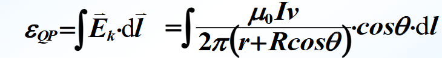
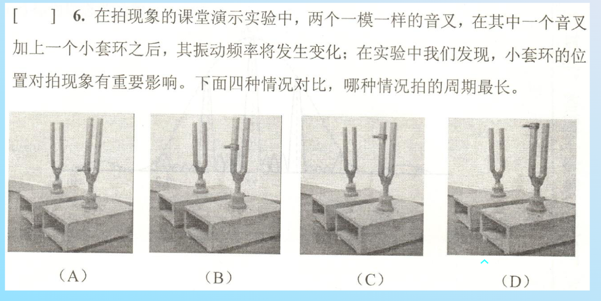
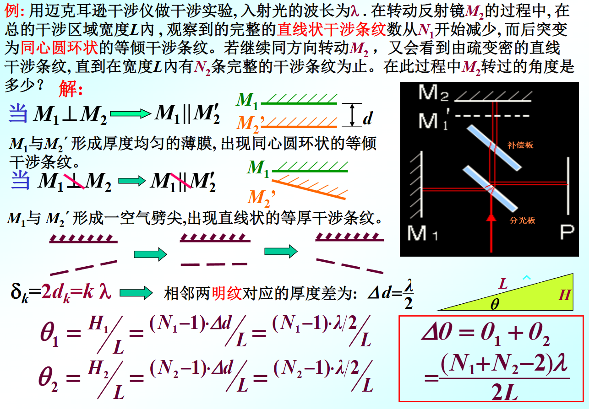

这个问题涉及到一个典型的电磁学积分计算，通常出现在计算一段圆弧形导线（如半圆环）在通电长直导线产生的磁场中运动时产生的**动生电动势（Motional EMF）**。

公式中的物理量含义推测如下：
*   $\frac{\mu_0 I}{2\pi(r + R\cos\theta)}$：这是距离长直导线 $(r + R\cos\theta)$ 处的磁感应强度 $B$ 的大小。
*   $v$：导线的运动速度。
*   $\cos\theta$：来自于 $\vec{E}_k \cdot d\vec{l}$ 的点积，表示速度方向或路径切向与电场方向的夹角投影。
*   $dl$：积分路径微元。
*   几何结构：一个半径为 $R$ 的圆弧，其圆心距离长直导线为 $r$。

---

### **完整计算步骤**

我们需要计算的积分是：
$$ \varepsilon_{QP} = \int \frac{\mu_0 I v}{2\pi(r + R\cos\theta)} \cdot \cos\theta \cdot dl $$

#### **第1步：确定积分变量关系**
由于被积函数中含有 $\cos\theta$，且路径是圆弧，我们利用圆的弧长公式将 $dl$ 转换为角度 $d\theta$。
对于半径为 $R$ 的圆弧：
$$ dl = R \cdot d\theta $$

将 $dl$ 代入原式，并把常数项 $\frac{\mu_0 I v}{2\pi}$ 提取到积分号外面：
$$ \varepsilon_{QP} = \frac{\mu_0 I v}{2\pi} \int \frac{\cos\theta}{r + R\cos\theta} \cdot (R \, d\theta) $$
整理得：
$$ \varepsilon_{QP} = \frac{\mu_0 I v R}{2\pi} \int \frac{\cos\theta}{r + R\cos\theta} \, d\theta $$

#### **第2步：被积函数的代数变形（关键步骤）**
我们需要计算核心积分 $I_{core} = \int \frac{\cos\theta}{r + R\cos\theta} \, d\theta$。
为了求解这个积分，我们需要对分子进行凑项，使其包含分母的形式。

利用恒等变形：$\cos\theta = \frac{1}{R}(R\cos\theta) = \frac{1}{R}(r + R\cos\theta - r)$

代入积分中：
$$ \frac{\cos\theta}{r + R\cos\theta} = \frac{1}{R} \cdot \frac{r + R\cos\theta - r}{r + R\cos\theta} $$
$$ = \frac{1}{R} \left( \frac{r + R\cos\theta}{r + R\cos\theta} - \frac{r}{r + R\cos\theta} \right) $$
$$ = \frac{1}{R} \left( 1 - \frac{r}{r + R\cos\theta} \right) $$

#### **第3步：拆分积分**
将变形后的式子代回电动势表达式：
$$ \varepsilon_{QP} = \frac{\mu_0 I v R}{2\pi} \int \frac{1}{R} \left( 1 - \frac{r}{r + R\cos\theta} \right) \, d\theta $$

消去外面的 $R$ 和里面的 $\frac{1}{R}$：
$$ \varepsilon_{QP} = \frac{\mu_0 I v}{2\pi} \left[ \int d\theta - r \int \frac{1}{r + R\cos\theta} \, d\theta \right] $$

现在我们有两个积分要算：
1.  **第一项**：$\int d\theta = \theta$
2.  **第二项**：$\int \frac{1}{r + R\cos\theta} \, d\theta$

#### **第4步：计算标准积分 $\int \frac{1}{r + R\cos\theta} \, d\theta$**
这是一个标准的微积分积分形式。假设 $r > R$（圆环不包含长直导线），可以使用**万能代换**（Weierstrass substitution）：
令 $t = \tan(\frac{\theta}{2})$，则 $d\theta = \frac{2dt}{1+t^2}$，$\cos\theta = \frac{1-t^2}{1+t^2}$。

代入后经过推导（查积分表可知），该不定积分的结果为：
$$ \int \frac{1}{r + R\cos\theta} \, d\theta = \frac{2}{\sqrt{r^2 - R^2}} \arctan\left( \sqrt{\frac{r-R}{r+R}} \tan\frac{\theta}{2} \right) $$

#### **第5步：综合结果**
将上述结果组合起来，电动势的不定积分表达式为：
$$ \varepsilon_{QP} = \frac{\mu_0 I v}{2\pi} \left[ \theta - r \cdot \frac{2}{\sqrt{r^2 - R^2}} \arctan\left( \sqrt{\frac{r-R}{r+R}} \tan\frac{\theta}{2} \right) \right] \Bigg|_{\theta_{start}}^{\theta_{end}} $$

---

### **示例：如果是半圆（$-\frac{\pi}{2}$ 到 $\frac{\pi}{2}$）**
如果物理问题是计算半圆环（从 $-\pi/2$ 到 $\pi/2$）的电动势，我们代入上下限：

1.  **第一项**：$\theta \big|_{-\pi/2}^{\pi/2} = \frac{\pi}{2} - (-\frac{\pi}{2}) = \pi$
2.  **第二项**：
    当 $\theta = \pm \frac{\pi}{2}$ 时，$\tan(\frac{\theta}{2}) = \tan(\pm \frac{\pi}{4}) = \pm 1$。
    积分值为：
    $$ \frac{2}{\sqrt{r^2 - R^2}} \left[ \arctan\left(\sqrt{\frac{r-R}{r+R}}\right) - \arctan\left(-\sqrt{\frac{r-R}{r+R}}\right) \right] $$
    $$ = \frac{4}{\sqrt{r^2 - R^2}} \arctan\left(\sqrt{\frac{r-R}{r+R}}\right) $$
    
    *利用数学恒等式 $2\arctan x = \arccos \frac{1-x^2}{1+x^2}$，该项可以简化为 $\frac{2}{\sqrt{r^2 - R^2}} \arccos(\frac{R}{r})$。*

**最终半圆的电动势公式通常为：**
$$ \varepsilon_{QP} = \frac{\mu_0 I v}{2\pi} \left[ \pi - \frac{2r}{\sqrt{r^2 - R^2}} \arccos\left(\frac{R}{r}\right) \right] $$
*(注：具体正负号和形式取决于题目的坐标系定义和积分方向)*

***

**答案：** [ A ]

**解析：**

要解答这个问题，我们需要理解“拍（Beat）”现象的原理以及附加质量对音叉频率的影响。

1.  **拍的周期与频率差的关系：**
    *   **拍频率 ($f_{beat}$)** 等于两个声波频率之差的绝对值：$f_{beat} = |f_1 - f_2|$。
    *   **拍周期 ($T$)** 是拍频率的倒数：$T = \frac{1}{f_{beat}} = \frac{1}{|f_1 - f_2|}$。
    *   题目问的是哪种情况**“拍的周期最长”**。根据公式，要使周期 $T$ 最大，分母（频率差 $|f_1 - f_2|$）必须**最小**。也就是说，带套环音叉的频率必须**最接近**原来不带套环音叉的频率。

2.  **套环对音叉频率的影响：**
    *   音叉臂可以看作是悬臂梁。给振动系统增加质量（套环）会增加惯性，从而导致系统的固有频率**降低**。
    *   两个音叉原本一模一样，频率相同。加上套环后，该音叉的频率会变小。
    *   频率降低的幅度取决于套环的位置：
        *   **音叉臂顶端（自由端）**：振动幅度最大，速度最大。在此处增加质量对系统动能和惯性的影响最大，因此会导致频率**下降最多**。
        *   **音叉臂底部（固定端）**：振动幅度极小（接近节点）。在此处增加质量对系统的振动几乎没有影响，因此频率**下降最少**，变化极其微弱。

3.  **综合分析四个选项：**
    *   **图 (D)**：套环在最顶端。对振动阻碍最大，频率下降最多，与原频率的差值 $\Delta f$ 最大，因此拍频最高，**拍周期最短**。
    *   **图 (C) 和 (B)**：套环位置逐渐降低，频率变化幅度逐渐减小，频率差减小，拍周期变长。
    *   **图 (A)**：套环在最底端（靠近根部）。此处振动幅度极小，套环的存在对频率的影响最小。此时带套环音叉的频率**最接近**原音叉的频率，两者的频率差 $|f_1 - f_2|$ **最小**。
    *   根据 $T = \frac{1}{\text{最小的频率差}}$，此时得到的**拍周期最长**。

综上所述，套环位置越低，对频率影响越小，频率差越小，拍的周期越长。

**故选 A。**

这是一个基于**迈克尔逊干涉仪（Michelson Interferometer）**原理的物理计算题。题目要求计算反射镜 $M_2$ 在整个过程中转过的总角度。

下面我为你详细拆解这个解题过程：

### 1. 物理过程分析

这个过程描述了迈克尔逊干涉仪中反射镜 $M_2$ 从倾斜到平行，再到反向倾斜的过程：

1.  **初始状态（直线条纹）**：
    *   $M_1$ 与 $M_2'$（$M_2$ 的虚像）不平行，它们之间形成一个**楔形空气膜**（Air Wedge）。
    *   此时发生的是**等厚干涉**，表现为**直线状干涉条纹**。
    *   此时楔角为 $\theta_1$，条纹数为 $N_1$。

2.  **中间状态（同心圆环）**：
    *   转动过程中，条纹突然变为同心圆环。这意味着 $M_1$ 与 $M_2'$ 变得**平行**了。
    *   此时发生的是**等倾干涉**。这是一个关键的“零点”，说明镜子转过了水平位置。

3.  **最终状态（直线条纹）**：
    *   继续同方向转动，$M_1$ 与 $M_2'$ 再次形成楔形，但倾斜方向与初始状态相反。
    *   再次出现**直线状干涉条纹**。
    *   此时楔角为 $\theta_2$，条纹数为 $N_2$。

**结论**：镜子 $M_2$ 的总转动角度 $\Delta\theta$ 等于初始倾角 $\theta_1$ 加上最终倾角 $\theta_2$，即 $\Delta\theta = \theta_1 + \theta_2$。

---

### 2. 核心公式推导

我们需要建立**条纹数量**与**楔角（镜子倾角）**之间的关系。

1.  **相邻明纹的高度差**：
    对于等厚干涉（空气劈尖），光程差 $\delta = 2d + \frac{\lambda}{2}$（$\lambda/2$是半波损失，这里不影响间距计算）。
    相邻两级明纹（$k$ 和 $k+1$）对应的空气膜厚度差 $\Delta d$ 满足：
    $$2 \cdot \Delta d = \lambda \Rightarrow \Delta d = \frac{\lambda}{2}$$
    即：每增加一条条纹，空气楔的厚度就增加半个波长。

2.  **计算楔形的高度 $H$**：
    在宽度 $L$ 的范围内，我们看到了 $N$ 条完整的条纹。
    这意味着在长度 $L$ 上，有 $N-1$ 个条纹间距。
    因此，空气楔两端的高度差 $H$ 为：
    $$H = (N - 1) \cdot \Delta d = (N - 1) \cdot \frac{\lambda}{2}$$

3.  **计算楔角 $\theta$**：
    由于角度很小，$\tan\theta \approx \theta$。
    根据几何关系（右下角的绿色三角形）：
    $$\theta = \frac{H}{L}$$
    代入 $H$ 的表达式：
    $$\theta = \frac{(N - 1)\lambda}{2L}$$

---

### 3. 计算总转动角度

现在我们将上述公式应用到两个阶段：

*   **第一阶段（转动前）**：
    观测到 $N_1$ 条条纹，对应的倾角为：
    $$\theta_1 = \frac{(N_1 - 1)\lambda}{2L}$$

*   **第二阶段（转动后）**：
    观测到 $N_2$ 条条纹，对应的倾角为：
    $$\theta_2 = \frac{(N_2 - 1)\lambda}{2L}$$

*   **总角度 $\Delta\theta$**：
    因为是从一侧倾斜穿过平行位置转到另一侧倾斜，所以总角度是两者之和：
    $$\Delta\theta = \theta_1 + \theta_2$$
    $$\Delta\theta = \frac{(N_1 - 1)\lambda}{2L} + \frac{(N_2 - 1)\lambda}{2L}$$

    提取公因式 $\frac{\lambda}{2L}$ 并整理括号内的项：
    $$\Delta\theta = \frac{\lambda}{2L} (N_1 - 1 + N_2 - 1)$$
    $$\Delta\theta = \frac{(N_1 + N_2 - 2)\lambda}{2L}$$

### 总结

最终的公式解释为：
$$ \Delta\theta = \frac{(N_1 + N_2 - 2)\lambda}{2L} $$

*   $\lambda$：入射光波长。
*   $L$：观测区域的宽度。
*   $N_1, N_2$：起始和结束时观测到的完整条纹数。
*   减去的 $2$ 来自于两次计数中的首项间隔修正（即 $N$ 条纹对应 $N-1$ 个间距）。