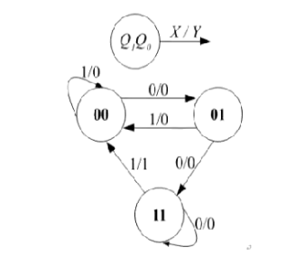
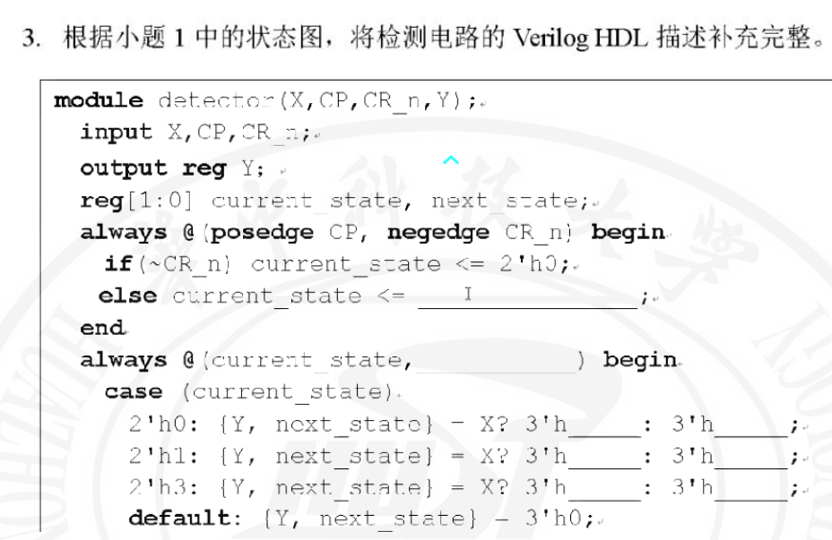
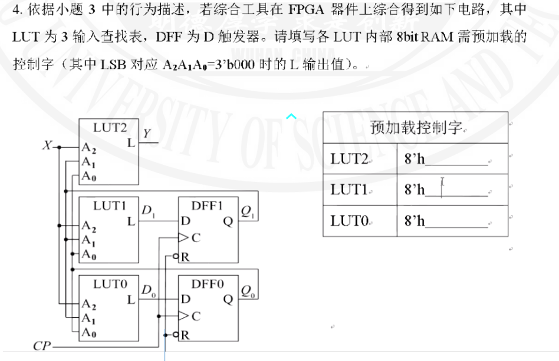

 



这是一道关于有限状态机（FSM）设计的 Verilog 填空题。我们需要根据给出的状态转移图来补全代码。

### **解答**

将代码中缺失的部分补充完整如下：

1.  **I 处填：** `next_state`
2.  **always @(...) 括号中填：** `X`
3.  **2'h0 行的填空：** 第一个填 `0`，第二个填 `1`
4.  **2'h1 行的填空：** 第一个填 `0`，第二个填 `3`
5.  **2'h3 行的填空：** 第一个填 `4`，第二个填 `3`

**完整的代码段如下：**

```verilog
module detector(X, CP, CR_n, Y);
    input X, CP, CR_n;
    output reg Y;
    reg [1:0] current_state, next_state;

    // 时序逻辑：状态寄存器更新
    always @(posedge CP, negedge CR_n) begin
        if (~CR_n) current_state <= 2'h0;
        else current_state <= next_state; // 填空 I
    end

    // 组合逻辑：次态和输出逻辑
    always @(current_state, X) begin      // 填空：敏感列表需包含输入 X
        case (current_state)
            2'h0: {Y, next_state} = X ? 3'h0 : 3'h1; // 填空：0 和 1
            2'h1: {Y, next_state} = X ? 3'h0 : 3'h3; // 填空：0 和 3
            2'h3: {Y, next_state} = X ? 3'h4 : 3'h3; // 填空：4 和 3
            default: {Y, next_state} = 3'h0;
        endcase
    end
endmodule
```

---

### **解释**

**1. 状态寄存器更新 (`else current_state <= ______;`)**
在时序逻辑块中，状态机在时钟上升沿将当前状态 `current_state` 更新为计算出的下一个状态。因此，这里应填入 `next_state`。

**2. 组合逻辑敏感列表 (`always @(current_state, ______)`)**
该 `always` 块描述的是组合逻辑（Next State Logic 和 Output Logic），其输出取决于当前状态 `current_state` 和输入信号 `X`。为了确保逻辑在输入变化时立即更新，敏感列表必须包含所有输入信号。因此，这里缺失的是输入信号 `X`。

**3. `case` 语句中的状态转移与输出逻辑**
代码中使用了一个拼接赋值 `{Y, next_state}`，总共 3 位宽。其中最高位（第2位）是输出 `Y`，低两位（第1:0位）是 `next_state`。三元运算符 `X ? A : B` 表示如果输入 `X` 为 1 则取值 A，为 0 则取值 B。

我们需要根据状态转移图中的 `X/Y`（输入/输出）标记来计算对应的 3 位十六进制值：

*   **状态 `00` (对应代码 `2'h0`)：**
    *   **当 X=1 时：** 转移图标记为 `1/0`（输入1，输出0），次态指向 `00`。
        *   `Y` = 0
        *   `next_state` = `00` (二进制)
        *   拼接 `{Y, next_state}` = `0_00` (二进制) = **`3'h0`**。
    *   **当 X=0 时：** 转移图标记为 `0/0`，次态指向 `01`。
        *   `Y` = 0
        *   `next_state` = `01` (二进制)
        *   拼接 `{Y, next_state}` = `0_01` (二进制) = **`3'h1`**。

*   **状态 `01` (对应代码 `2'h1`)：**
    *   **当 X=1 时：** 转移图标记为 `1/0`，次态指向 `00`。
        *   `Y` = 0
        *   `next_state` = `00` (二进制)
        *   拼接 `{Y, next_state}` = `0_00` (二进制) = **`3'h0`**。
    *   **当 X=0 时：** 转移图标记为 `0/0`，次态指向 `11`。
        *   `Y` = 0
        *   `next_state` = `11` (二进制) = 3 (十进制)。
        *   拼接 `{Y, next_state}` = `0_11` (二进制) = **`3'h3`**。

*   **状态 `11` (对应代码 `2'h3`)：**
    *   **当 X=1 时：** 转移图标记为 `1/1`，次态指向 `00`。
        *   `Y` = 1
        *   `next_state` = `00` (二进制)
        *   拼接 `{Y, next_state}` = `1_00` (二进制) = **`3'h4`**。
    *   **当 X=0 时：** 转移图标记为 `0/0`，次态指向 `11`。
        *   `Y` = 0
        *   `next_state` = `11` (二进制)
        *   拼接 `{Y, next_state}` = `0_11` (二进制) = **`3'h3`**。
***   



### 解答

根据题目给出的电路图和第3题中的 Verilog 描述，各 LUT 的预加载控制字如下：

*   **LUT2:** 8'h **80**
*   **LUT1:** 8'h **0A**
*   **LUT0:** 8'h **0B**

---

### 解释

**1. 确定 LUT 的输入与地址映射**
根据电路连接图：
*   LUT 的输入端口 $A_2$ 连接 $X$。
*   LUT 的输入端口 $A_1$ 连接 $Q_1$ (当前状态高位)。
*   LUT 的输入端口 $A_0$ 连接 $Q_0$ (当前状态低位)。

因此，LUT 的 8 个存储单元对应的地址（Address）由 $X, Q_1, Q_0$ 组成，即 $Address = \{X, Q_1, Q_0\}$。题目指出 LSB 对应地址 0，这意味着控制字二进制的第 $k$ 位对应地址 $k$ 的输出值。我们通常将地址 7 放在最高位（MSB），地址 0 放在最低位（LSB）。

**2. 确定状态转移真值表**
根据第3题 Verilog 代码中的 `case` 语句及 `default` 处理（未定义状态 `10` 输出和次态均为 0），我们可以列出完整的真值表。

其中：
*   **LUT2 输出 $Y$**：即电路的总输出。
*   **LUT1 输出 $D_1$**：即次态的高位 ($Q_{1\_next}$)。
*   **LUT0 输出 $D_0$**：即次态的低位 ($Q_{0\_next}$)。

| 地址 (Hex) | $A_2(X)$ | $A_1(Q_1)$ | $A_0(Q_0)$ | 当前状态 | 输入 X | 次态 ($D_1 D_0$) | LUT2 输出 (Y) | LUT1 输出 ($D_1$) | LUT0 输出 ($D_0$) |
| :---: | :---: | :---: | :---: | :---: | :---: | :---: | :---: | :---: | :---: |
| **0** | 0 | 0 | 0 | `00` | 0 | `01` | 0 | **0** | **1** |
| **1** | 0 | 0 | 1 | `01` | 0 | `11` | 0 | **1** | **1** |
| **2** | 0 | 1 | 0 | `10` (default) | 0 | `00` | 0 | **0** | **0** |
| **3** | 0 | 1 | 1 | `11` | 0 | `11` | 0 | **1** | **1** |
| **4** | 1 | 0 | 0 | `00` | 1 | `00` | 0 | **0** | **0** |
| **5** | 1 | 0 | 1 | `01` | 1 | `00` | 0 | **0** | **0** |
| **6** | 1 | 1 | 0 | `10` (default) | 1 | `00` | 0 | **0** | **0** |
| **7** | 1 | 1 | 1 | `11` | 1 | `00` | 1 | **0** | **0** |

**3. 计算控制字 (从地址 7 排列到 地址 0)**

*   **LUT2 (输出 Y):**
    *   序列 (7 $\to$ 0): `1 0 0 0 0 0 0 0`
    *   十六进制: **8'h80**

*   **LUT1 (输出 $D_1$):**
    *   序列 (7 $\to$ 0): `0 0 0 0 1 0 1 0`
    *   十六进制: **8'h0A**

*   **LUT0 (输出 $D_0$):**
    *   序列 (7 $\to$ 0): `0 0 0 0 1 0 1 1`
    *   十六进制: **8'h0B**