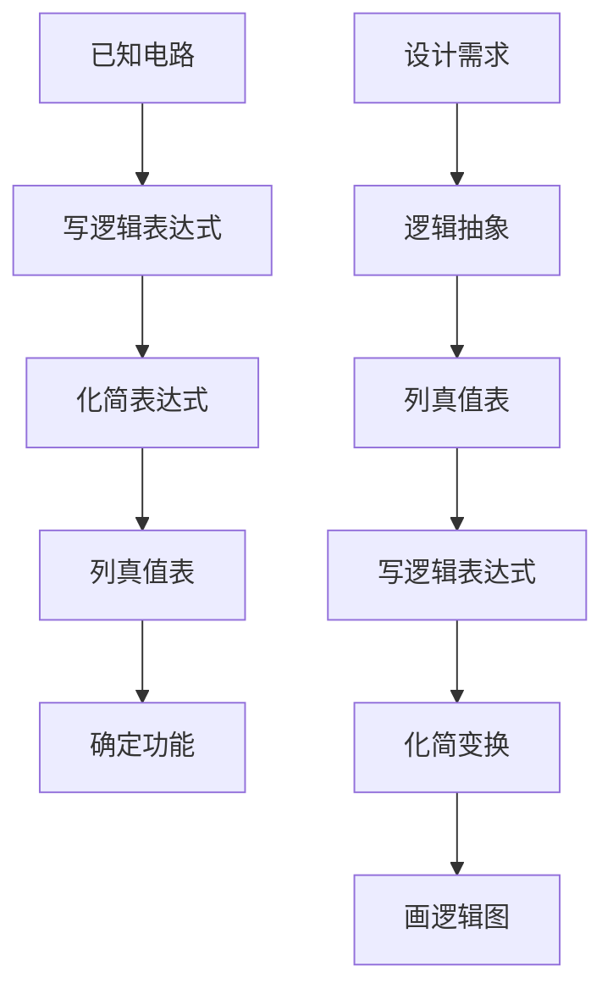

# 第四章 组合逻辑电路 - 核心总结与方法汇总

## 一、组合逻辑电路基础

### 1. 定义与特征
- **定义**：在任何时刻，电路的输出状态只取决于同一时刻的输入状态，与电路原来的状态无关
- **结构特征**：
  - 输出、输入之间没有反馈延迟通路
  - 不含记忆单元
- **一般框图**：$L_i = f(A_1, A_2, \dots, A_n) \quad (i=1, 2, \dots, m)$

### 2. 分析方法
1. 由逻辑图写出各输出端的逻辑表达式
2. 化简和变换逻辑表达式
3. 列出真值表
4. 根据真值表或逻辑表达式，分析确定其功能

> **实例**：奇校验电路、二进制码反码电路等

### 3. 设计方法
1. **逻辑抽象**：确定输入/输出变量，定义逻辑状态含义
2. **列出真值表**：根据逻辑功能描述
3. **写出逻辑表达式**：由真值表推导
4. **化简和变换**：得到最简表达式
5. **画出逻辑图**：实现电路

> **设计技巧**：
> - 利用任意项简化设计
> - 共享相同乘积项减少门电路数量
> - 根据指定芯片优化实现
> - 考虑多级逻辑实现以减少连线

### 4. 竞争冒险现象
- **产生原因**：信号传输延迟不同，导致输出出现瞬间错误脉冲
- **判断方法**：当逻辑表达式可简化成 $A \cdot \bar{A}$ 或 $A + \bar{A}$ 形式时，可能产生冒险
- **消除方法**：
  1. **发现并消除互补变量**：逻辑变换消除互补项
  2. **增加乘积项**：避免互补项相加，如 $A\bar{B} + \bar{A}C + BC$
  3. **输出端并联电容器**：在输出端并联4~20pF电容滤除窄脉冲

## 二、典型组合逻辑电路

### 1. 编码器
- **定义**：将特定含义的信号赋予二进制代码的电路
- **类型**：
  - **普通编码器**：只允许一个有效输入，否则输出混乱
  - **优先编码器**：允许多个有效输入，按优先级编码
- **典型电路**：
  - 4线-2线优先编码器
  - 8421BCD码编码器
  - CD4532 8线-3线优先编码器
- **扩展应用**：多片级联实现更多输入线的编码器

### 2. 译码器
- **定义**：编码的逆过程，将二进制代码转换为特定含义信号
- **类型**：
  - **二进制译码器**：如3线-8线译码器74HC138
  - **二-十进制译码器**：4线-10线译码器
  - **显示译码器**：驱动七段显示器
- **功能特点**：
  - 使能端有效时，对应输入代码只有一个输出有效
  - 输出包含输入变量的所有最小项
- **应用**：
  - 实现逻辑函数：输出端接与非门
  - 用作数据分配器
  - 外设选择电路
  - 动态显示控制

### 3. 数据选择器
- **定义**：在通道选择信号作用下，将多个通道数据传送到公共数据通道
- **结构**：相当于多输入单刀多掷开关
- **典型芯片**：
  - 4选1数据选择器
  - 8选1数据选择器74HC151
- **应用**：
  - **位扩展**：多片并联实现多位数据选择
  - **字扩展**：级联实现更多输入通道（如16选1）
  - **逻辑函数实现**：利用数据输入端和选择端
  - **数据转换**：并行到串行数据转换
  - **查找表(LUT)**：构成FPGA基本单元

### 4. 数值比较器
- **功能**：比较两个数字大小
- **类型**：
  - 1位数值比较器
  - 2位数值比较器
  - 4位数值比较器74HC85
- **扩展方法**：
  - **串联扩展**：低速，结构简单
  - **并联扩展**：高速，电路复杂
- **工作原理**：
  - $F_{A>B} = (A_1>B_1) + (A_1=B_1)(A_0>B_0)$
  - $F_{A=B} = (A_1=B_1)(A_0=B_0)$
  - $F_{A<B} = (A_1<B_1) + (A_1=B_1)(A_0<B_0)$

### 5. 算术运算电路
- **加法器**：
  - **半加器**：不考虑低位进位
  - **全加器**：考虑低位进位
    - 和：$S_i = A_i \oplus B_i \oplus C_{i-1}$
    - 进位：$C_i = A_iB_i + (A_i \oplus B_i)C_{i-1}$
- **多位加法器**：
  - **串行进位**：低位进位传至高位，速度慢
  - **超前进位**：预先计算所有进位，速度快
    - $G_i = A_iB_i$（进位产生）
    - $P_i = A_i \oplus B_i$（进位传递）
    - $C_i = G_i + P_iC_{i-1}$
- **典型芯片**：74HC283 4位超前进位加法器
- **减法运算**：通过加补码实现 $A-B = A+(-B) = A+\bar{B}+1$

## 三、组合可编程逻辑器件(PLD)

### 1. 基本结构
- **组成**：输入电路、与门阵列、或门阵列、输出电路
- **表示方法**：
  - 硬线连接单元
  - 被编程接通单元
  - 被编程擦除单元

### 2. PLD分类
- **低密度PLD(LDPLD)**：
  - PROM：与阵列固定，或阵列可编程
  - PLA：与、或阵列均可编程
  - PAL/GAL：与阵列可编程，或阵列固定
- **高密度PLD(HDPLD)**：
  - CPLD：多个逻辑块通过可编程连线连接
  - FPGA：基于查找表(LUT)结构，高度灵活

### 3. GAL结构特点
- **输出逻辑宏单元(OLMC)**：可编程配置为不同工作模式
- **控制字**：配置OLMC工作状态
- **优点**：
  - 电可擦除，可多次编程
  - 通用性强，可实现PAL所有输出模式
  - 工作速度快，功耗小

### 4. FPGA基本原理
- **查找表(LUT)**：存储真值表实现逻辑函数
- **结构**：
  - 可编程逻辑块：LUT+触发器
  - 可编程互联开关：连接各逻辑块
  - I/O模块：芯片与外部接口
- **与CPLD区别**：
  - FPGA：基于SRAM，细粒度结构，连线资源丰富
  - CPLD：基于EEPROM，粗粒度结构，延时固定，适合控制逻辑

## 四、核心方法总结

### 1. 电路分析设计流程

### 2. 竞争冒险消除策略
- **代数法**：增加乘积项消除互补项
- **卡诺图法**：增加多余圈覆盖相邻最小项
- **硬件法**：输出端并联小电容滤波

### 3. 电路实现优化技巧
- **多输出共享**：提取公共乘积项
- **门电路限制**：考虑扇入数限制进行多级设计
- **PLD实现**：考虑芯片资源限制优化表达式
- **功能分解**：将复杂函数分解为简单子函数

### 4. 扩展应用方法
- **编码器/译码器**：多片级联扩大输入/输出范围
- **数据选择器**：位扩展和字扩展
- **比较器**：串联和并联扩展提高位数
- **加法器**：级联实现多位加法运算

## 五、典型芯片速查表

| 芯片型号 | 功能 | 特点 | 应用 |
|---------|------|------|------|
| CD4532 | 8线-3线优先编码器 | 有使能端和标志位 | 键盘编码、多设备请求 |
| 74HC138 | 3线-8线译码器 | 3个使能端 | 地址译码、逻辑函数实现 |
| 74HC151 | 8选1数据选择器 | 互补输出 | 数据选择、逻辑函数实现 |
| 74HC85 | 4位数值比较器 | 有级联输入 | 多位数据比较 |
| 74HC283 | 4位超前进位加法器 | 高速运算 | 算术运算、码制转换 |
| GAL16V8 | 可编程逻辑器件 | OLMC结构 | 组合/时序逻辑实现 |

> **注**：本章内容是数字电路设计的核心基础，掌握这些电路的工作原理和设计方法，为后续时序逻辑电路和数字系统设计奠定基础。在实际应用中，应根据具体需求选择合适的电路实现方案，并考虑速度、功耗、成本等因素进行优化设计。