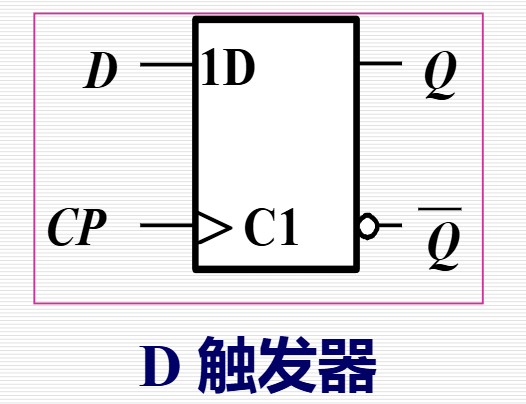
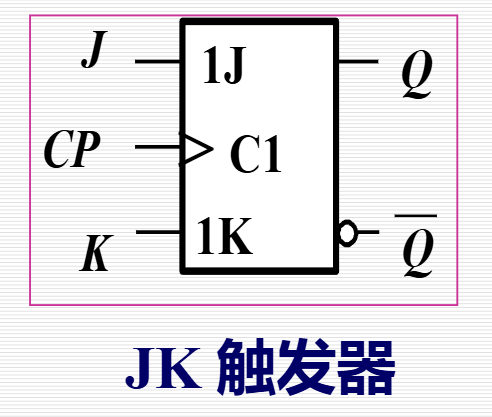
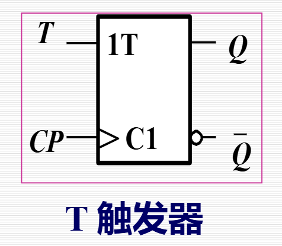
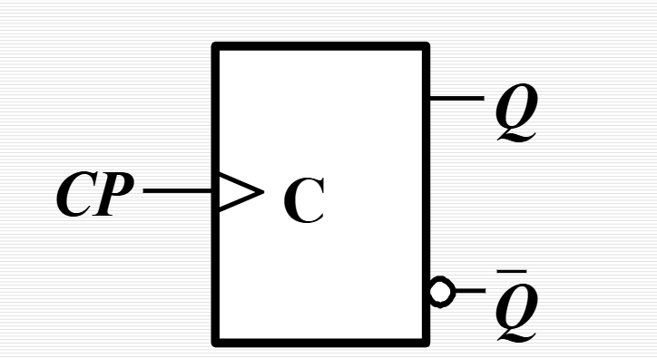
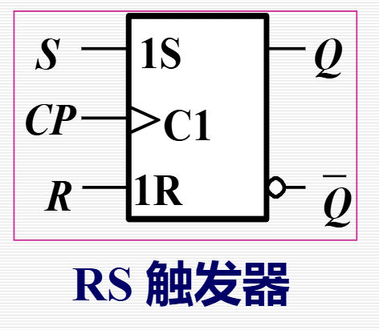

# 第5章 锁存器和触发器 总结

## 重要知识点

### 5.1 双稳态电路
- **概念**：双稳态电路是具有两个稳定状态（0和1）的电路，能自行保持状态，是锁存器和触发器的基础。
- **基本双稳态电路结构**：由两个反相器交叉耦合形成，具有互补输出Q和Q̄。电路具有记忆功能，能存储1位二进制信息。
- **逻辑状态分析**：电路有两个稳定状态，Q=1或Q=0，输出状态定义为Q端的状态。
- **模拟特性**：传输特性曲线分析，存在两个稳定点和一个亚稳态点。
- **问题**：基本双稳态电路缺少控制信号，无法主动改变状态。

### 5.2 SR锁存器
- **基本SR锁存器**：
  - **结构**：由两个与非门交叉耦合形成，输入S（置1端）和R（置0端）。
  - **逻辑功能**：S和R均为高电平有效。
    - 功能表：
      | R | S | Q<sup>n</sup> | Q<sup>n+1</sup> | 说明     |
      |---|---|-----|---------|----------|
      | 1 | 1 | x   | x       | 不定     |
      | 1 | 0 | 1   | 0       | 置0      |
      | 0 | 1 | 0   | 1       | 置1      |
      | 0 | 0 | Q<sup>n</sup> | Q<sup>n</sup>     | 保持不变 |
    - 约束条件：RS=0（避免不定状态）。
    - 特性方程：Q<sup>n+1</sup> = S + \overline{R} Q<sup>n</sup> (SR=0)。
    - 状态转换图：0和1状态之间根据S/R切换，不定状态避免。
  - **动态特性**：传输延迟时间t_{PLH}和t_{PHL}，脉冲宽度t_W（输入脉冲需大于t_W以避免不稳定）。
  - **应用**：去抖动电路（消除机械开关触点抖动），使用SR锁存器和电阻实现稳定输出。
- **门控SR锁存器**：
  - **结构**：基本SR锁存器加使能端E（高电平有效）。
  - **逻辑功能**：E=0时状态不变；E=1时同基本SR锁存器。
    - 功能表 (E=1)：同基本SR。
  - **动作特点**：E=1期间对信号敏感，按S/R改变状态；E=0状态不变。
  - **波形分析**：根据E门控电平确定状态变化时机。
### 5.3 D锁存器
- **逻辑门控D锁存器**：
  - **结构**：基于SR锁存器，通过反相器使S=D, R=\overline{D}，避免SR=1不定状态。
  - **逻辑功能**：单输入D，使能端E。
    - 功能表：
      | E | D | Q | \overline{Q} | 功能 |
      |---|---|----|--------------|------|
      | 0 | x | Q<sup>n</sup> | \overline{Q<sup>n</sup>} | 保持 |
      | 1 | 0 | 0 | 1 | 置0 |
      | 1 | 1 | 1 | 0 | 置1 |
  - **特性方程**：Q<sup>n+1</sup> = D (E=1时)。
  - **动作特点**：E=1时Q跟随D变化；E=0状态不变。没有不定状态。
- **传输门控D锁存器**：
  - **结构**：使用传输门（TG）控制输入和反馈。
  - **工作原理**：E=1时TG1导通, Q=D；E=0时TG2导通, 状态保持。
  - **波形**：Q在E高电平期间跟随D，在E下降沿锁存D的值。
- **典型集成电路**：74HC/HCT373 (8位D锁存器)：
  - 具有OE (输出使能, 低有效) 和LE (锁存使能, 高有效)。
  - 功能表：
    | 模式 | OE | LE | D_n | 内部状态 | 输出 |
      |------|----|----|-----|----------|------|
      | 传送 | L | H | L | L | L |
      | 传送 | L | H | H | H | H |
      | 锁存 | L | L | x | 保持 | 保持 |
      | 禁止 | H | x | x | x | 高阻 |
- **动态特性**：
  - 建立时间t_SU：D对E下降沿的最少提前量。
  - 保持时间t<sub>H</sub>：D对E下降沿的最少保持量。
  - 脉冲宽度t_W：E高电平宽度。
  - 传输延迟时间t_PLH/t_PHL：E下降沿到输出变化的延迟。

### 5.4 触发器的电路结构和工作原理 (以D触发器为例)
- **主从D触发器**：
  - **结构**：主锁存器和从锁存器串联，使用传输门TG控制。
    - 主锁存器：TG1, TG2。
    - 从锁存器：TG3, TG4。
  - **工作原理**：
    - CP=0：主锁存器输入D, 从锁存器保持。
    - CP=0→1：主锁存器保持, 从锁存器更新Q = D (边沿触发)。
  - **特点**：上升沿触发, 状态仅取决于CP上升沿前瞬间D。
- **具有清零/置数输入的主从D触发器**：
  - **结构**：添加异步置0 ($\overline{R_D}$) 和置1 ($\overline{S_D}$) 输入。
  - **工作**：异步置位优先于CP，$\overline{R_D}$=0置0, $\overline{S_D}$=0置1。
  - **集成电路**：74HC/HCT74 (双D触发器), 功能表包括置位。
- **具有使能控制的主从D触发器**：
  - **结构**：数据选择器控制D输入, EN使能。
  - **工作**：EN=0保持, EN=1 Q=D (CP上升沿)。
- **其他结构**：
  - **维持阻塞触发器**：使用门电路, CP=0时D进入, CP=1时刷新Q=D, 状态不变时阻塞。
  - **传输延迟结构**：类似, 强调延迟确保稳定。
- **动态特性**：
  - 建立时间t_SU：D对CP上升沿提前量。
  - 保持时间t_H：D对CP上升沿保持量。
  - 脉冲宽度t_W：CP最小宽度。
  - 传输延迟t_PLH/t_PHL：CP到输出延迟。
  - 最高频率f_cmax：内部延迟限制最高CP频率。

### 5.5 触发器的逻辑功能
- **不同触发器的国际逻辑符号**：D, JK, T, RS触发器有标准符号, CP为时钟, 箭头表示边沿触发。

- **D触发器**：



  - 特性表：
    | D | Q<sup>n</sup> | Q<sup>{n+1}</sup> |
    |---|-----|---------|
    | 0 | 0   | 0       |
    | 0 | 1   | 0       |
    | 1 | 0   | 1       |
    | 1 | 1   | 1       |
  - 特性方程：Q<sup>{n+1}</sup> = D。
  - 状态图：0→0 (D=0), 0→1 (D=1)；1→0 (D=0), 1→1 (D=1)。

- **JK触发器**：



  - 特性表：
    | J | K | Q<sup>n</sup> | Q<sup>n+1</sup> | 说明 |
    |---|---|-----|---------|------|
    | 0 | 0 | 0   | 0       | 不变 |
    | 0 | 0 | 1   | 1       |      |
    | 0 | 1 | 0   | 0       | 置0  |
    | 0 | 1 | 1   | 0       |      |
    | 1 | 0 | 0   | 1       | 置1  |
    | 1 | 0 | 1   | 1       |      |
    | 1 | 1 | 0   | 1       | 翻转 |
    | 1 | 1 | 1   | 0       |      |
  - 特性方程：Q<sup>n+1</sup> = J $\overline{Q^n}$ + $\overline{K}$ Q<sup>n</sup>。
  - 状态转换图：包括翻转功能。

- **T触发器**：


  - 特性表：T=0不变, T=1翻转。
  - 特性方程：Q<sup>n+1</sup> = T $\overline{Q^n}$ + $\overline{T}$ Q<sup>n</sup>。
  - 状态图：翻转环。

- **T'触发器**：


  - 特性方程 Q<sup>n+1</sup> = $\overline{Q^n}$ (始终翻转)。

- **RS触发器**：



  - 特性表：
    | Q<sup>n</sup> | S | R | Q<sup>n+1</sup> |
    |-----|---|------|---------|
    | 0   | 0 | 0   | 0       |
    | 0   | 0 | 1   | 0       |
    | 0   | 1 | 0   | 1       |
    | 0   | 1 | 1   | 不确定  |
    | 1   | 0 | 0   | 1       |
    | 1   | 0 | 1   | 0       |
    | 1   | 1 | 0   | 1       |
    | 1   | 1 | 1   | 不确定  |
  - 特性方程：Q<sup>n+1</sup> = S + $\overline{R}$ Q<sup>n</sup> (SR=0)。
  - 状态图：类似SR锁存器。
- **D触发器功能转换**：
  - D构成JK：J/K通过门电路连接D和Q。
  - D构成T：T输入控制翻转。
  - D构成T'：D=$\overline{Q}$，二分频。
- **小结**：
  - 结构与工作特点：锁存器电平敏感, 触发器边沿敏感。
  - 逻辑功能描述：特性表、特性方程、状态图、波形图。
  - 电路结构与逻辑功能无必然联系。

### 5.6 用Verilog HDL描述锁存器和触发器
- **时序电路建模基础**：
  - **行为级描述**：使用always块 (无限循环), initial用于仿真 (不可综合)。
  - **always块用法**：always @(敏感事件表) begin ... end。
  - **敏感事件**：
    - 电平敏感 (锁存器)：always @(sel or a or b) - 任意变化执行。
    - 边沿触发 (触发器)：always @(posedge CP or negedge CR) - 上升/下降沿执行。
  - **过程赋值**：
    - 阻塞型 (=)：顺序执行。
    - 非阻塞型 (<=)：并行执行, 用于时序逻辑 (e.g., f <= A & B; g <= f | C - g用旧f)。
- **锁存器和触发器的Verilog建模**：
  - **D锁存器**：
    ```verilog
    module D_latch (Q, D, E);
    output Q;
    input D, E;
    reg Q;
    always @(E or D)
      if (E) Q <= D;
    endmodule
    ```
  - **D触发器**：
    ```verilog
    module DFF (output reg Q, input D, CP);
    always @(posedge CP)
      Q <= D;
    endmodule
    ```
  - **异步置位/复位D触发器**：
    ```verilog
    module async_set_rst_DFF (output reg Q, QN, input D, CP, Sd, Rd);
    always @(posedge CP, negedge Sd, negedge Rd)
      begin
        if (~Sd || ~Rd)
          if (~Sd ) begin Q <= 1'b1; QN <= 1'b0; end // 异步置1
          else begin Q <= 1'b0; QN <= 1'b1; end // 异步置0
        else begin Q <= D; QN <= ~D; end
      end
    endmodule
    ```
  - **逻辑功能**：该模块实现异步置位/复位D触发器, Sd低置1, Rd低置0, 否则边沿触发Q=D。

## 电路模型和处理方法汇总

### 电路模型
- **双稳态电路**：两个反相器交叉耦合, 输出Q和Q̄互补。
- **基本SR锁存器**：两个与非门交叉, 输入S/R高有效。
- **门控SR锁存器**：基本SR加E控制与门。
- **D锁存器**：
  - 逻辑门控：SR锁存器+D反相。
  - 传输门控：TG1输入D, TG2反馈, E控制。
- **主从D触发器**：主从两个D锁存器, CP控制TG, 上升沿触发。
- **维持阻塞触发器**：门电路实现D输入和状态保持, CP控制。
- **转换模型**：D转JK/T/RS通过逻辑门连接输入。

### 处理方法
- **波形画法**：根据敏感事件 (电平/边沿) 确定变化时刻, 按功能表更新状态。
- **状态分析**：用特性方程或表计算Q<sup>n+1</sup>, 注意约束条件避免不定。
- **动态特性分析**：测量t_SU, t_H, t_W, t_PLH/t_PHL, 计算f_cmax = 1/(延迟总和)。
- **Verilog建模**：用always @ (事件) , 非阻塞赋值 (<=) 模拟并行, 边沿/电平敏感区分触发器/锁存器。
- **应用处理**：去抖动用SR锁存, 转换用D基元构建其他类型, 集成电路用功能表验证。

## 格外重要板块：锁存器与触发器的区别及Verilog描述
- **区别**：
  - 锁存器：电平敏感 (E高/低期间敏感), 透明传输, 可能引入不定状态, Verilog用always @(E or D) if(E) Q <= D。
  - 触发器：边沿触发 (CP上升/下降沿敏感), 状态仅在瞬间变化, 更稳定, Verilog用always @(posedge CP) Q <= D。
  - 应用：锁存器用于简单存储, 触发器用于同步时序电路。
- **重要原因**：区别是时序电路设计核心, 错误可能导致赛跑或毛刺；Verilog描述是FPGA/ASIC实现基础, 需注意阻塞/非阻塞避免仿真综合不一致。