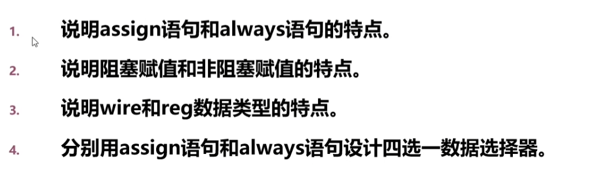
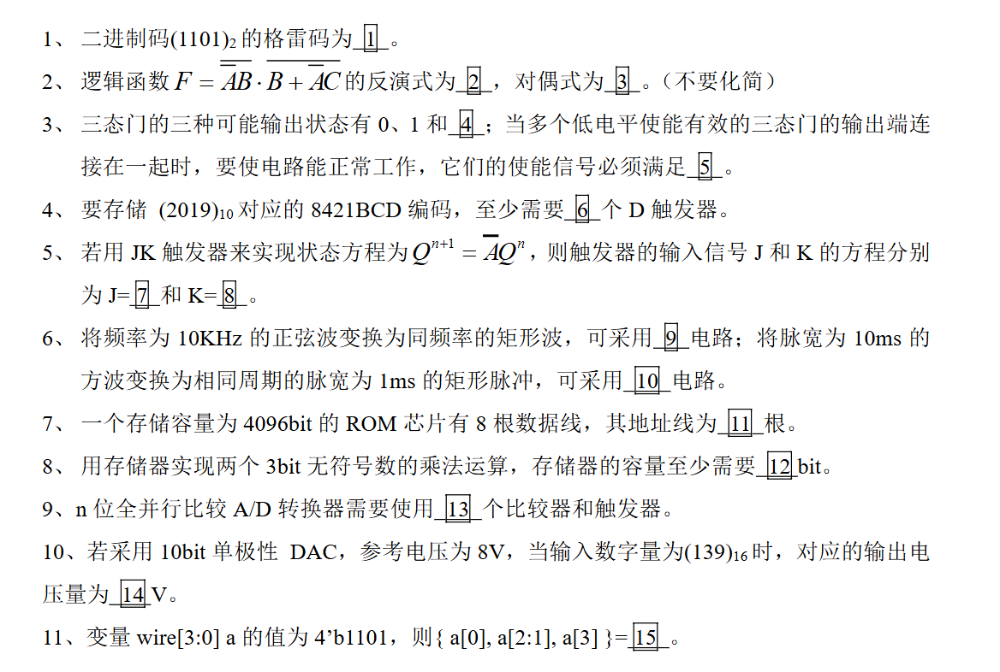

# Verilog DHL
***


这是一个非常标准的 Verilog 基础考核题。基于之前的讨论，我们可以非常精准地回答这四道题。

以下是针对图片中四个问题的详细解答：

---

### 1. 说明 assign 语句和 always 语句的特点

*   **assign 语句 (连续赋值语句):**
    *   **应用场景：** 专门用于描述**组合逻辑**电路。
    *   **被赋值对象：** 左侧必须是 `wire` (线网) 类型变量。
    *   **特点：**
        *   **总是处于激活状态**。只要右侧表达式中的任意一个信号发生变化，左侧的值**立刻**随之更新。
        *   类似于硬件电路中的直接连线，无法存储数据。
        *   语句之间是并行执行的，与书写顺序无关。

*   **always 语句 (过程赋值语句):**
    *   **应用场景：** 既可以描述**组合逻辑**，也可以描述**时序逻辑**。
    *   **被赋值对象：** 左侧必须是 `reg` (寄存器) 类型变量。
    *   **特点：**
        *   **需要触发条件**。只有满足敏感列表（`@`后面的内容）中的条件（如电平变化 `*` 或时钟沿 `posedge clk`）时，才会执行块内的语句。
        *   具有“记忆”特性，在下一次赋值前保持当前值。
        *   块内部的语句执行顺序取决于使用的是阻塞赋值还是非阻塞赋值。

---

### 2. 说明阻塞赋值和非阻塞赋值的特点

*   **阻塞赋值 (Blocking Assignment, `=`):**
    *   **特点：** 语句**串行**执行。即上一句执行完并更新了变量值之后，才会执行下一句。
    *   **效果：** 赋值是**立即**生效的。
    *   **用途：** 只能用于描述**组合逻辑** (在 `always @(*)` 中使用)。

*   **非阻塞赋值 (Non-Blocking Assignment, `<=`):**
    *   **特点：** 语句**并行**执行。块内所有语句右侧的表达式同时计算，但在块结束那一刻才同时更新左侧变量。
    *   **效果：** 赋值是**延后**生效的（当前语句的赋值不会影响下一句对该变量的读取）。
    *   **用途：** 只能用于描述**时序逻辑** (在 `always @(posedge clk)` 中使用)，用于生成触发器。

---

### 3. 说明 wire 和 reg 数据类型的特点

*   **wire (线网型):**
    *   **物理意义：** 代表物理导线或连线。
    *   **存储能力：** **无存储功能**。它的值完全由驱动它的源信号决定，源变它就变。
    *   **赋值方式：** 只能通过 `assign` 语句赋值，或者连接到模块的输出端口。
    *   **默认值：** `z` (高阻态)。

*   **reg (寄存器型):**
    *   **物理意义：** 代表一个抽象的数据存储单元（注意：虽然名字叫寄存器，但综合结果可能是触发器，也可能是导线）。
    *   **存储能力：** **有保持功能**。在新的赋值发生前，它会保持上一次的值。
    *   **赋值方式：** 只能在 `always` 或 `initial` 块内部进行赋值。
    *   **默认值：** `x` (未知态)。

---

### 4. 分别用 assign 语句和 always 语句设计四选一数据选择器

**假设端口定义如下：**
*   输入信号：`in0`, `in1`, `in2`, `in3` (4位数据)
*   选择信号：`sel` (2位控制信号)
*   输出信号：`out`

#### 方法一：使用 assign 语句 (组合逻辑)
这里使用条件运算符 `? :` (三目运算符) 来实现。

```verilog
module mux4_assign (
    input  wire in0, in1, in2, in3,
    input  wire [1:0] sel,
    output wire out  // 注意：assign赋值，输出必须是 wire
);

    // 嵌套的三目运算符
    assign out = (sel == 2'b00) ? in0 :
                 (sel == 2'b01) ? in1 :
                 (sel == 2'b10) ? in2 :
                 in3; // 2'b11 的情况

endmodule
```

#### 方法二：使用 always 语句 (组合逻辑)
这里使用 `case` 语句来实现，逻辑更清晰。

```verilog
module mux4_always (
    input  wire in0, in1, in2, in3,
    input  wire [1:0] sel,
    output reg  out  // 注意：always块赋值，输出必须是 reg
);

    // 组合逻辑敏感列表用 *，表示输入变化即触发
    always @(*) begin
        case (sel)
            2'b00: out = in0;  // 组合逻辑使用阻塞赋值 =
            2'b01: out = in1;
            2'b10: out = in2;
            2'b11: out = in3;
            default: out = in0; // 养成写 default 的好习惯，防止锁存器产生
        endcase
    end

endmodule
```

***

# 填空题
## 2018-2019

这是一份包含数字电路基础（数制、布尔代数、逻辑门、时序逻辑）和 Verilog 语法的填空题。

以下是每一题的详细解答和填空内容：

**1、二进制码(1101)₂ 的格雷码为 \_\_①\_\_ 。**
*   **答案：** **1011**
*   **解析：** 二进制转格雷码的方法是：最高位保留，其余位与其高一位进行异或运算。
    *   最高位：1
    *   次高位：1⊕1 = 0
    *   次低位：1⊕0 = 1
    *   最低位：0⊕1 = 1
    *   结果为 1011。

**2、逻辑函数 $F = \overline{AB} \cdot B + \overline{AC}$ 的反演式为 \_\_②\_\_ ，对偶式为 \_\_③\_\_ 。（不要化简）**
*   **答案 ② (反演式)：** **$(AB + \overline{B}) \cdot AC$**  (或者写成 $(AB+\overline{B})AC$)
*   **答案 ③ (对偶式)：** **$(\overline{A+B} + B) \cdot \overline{A+C}$**
*   **解析：**
    *   **反演式 ($\overline{F}$):** 对原式应用德·摩根定律。将 `·` 变 `+`，`+` 变 `·`，原变量变反，反变量变原（即整体加非号后展开）。
        $\overline{F} = \overline{(\overline{AB} \cdot B) + (\overline{AC})} = \overline{(\overline{AB} \cdot B)} \cdot \overline{(\overline{AC})} = (AB + \overline{B}) \cdot AC$
    *   **对偶式 ($F'$):** 将 `·` 变 `+`，`+` 变 `·`，0变1，1变0，保持变量和单个变量的非号不变。
        原式：$(\text{NOT}(A \cdot B) \cdot B) + \text{NOT}(A \cdot C)$
        对偶：$(\text{NOT}(A + B) + B) \cdot \text{NOT}(A + C) = (\overline{A+B} + B) \cdot \overline{A+C}$

**3、三态门的三种可能输出状态有 0、1 和 \_\_④\_\_ ；当多个低电平使能有效的三态门的输出端连接在一起时，要使电路能正常工作，它们的使能信号必须满足 \_\_⑤\_\_ 。**
*   **答案 ④：** **高阻态** (或 Z 态)
*   **答案 ⑤：** **任意时刻只允许一个为低电平** (或“互斥”、“只有一个有效”)
*   **解析：** 三态门输出为高电平、低电平和高阻态。总线结构中，为了防止总线冲突（短路），同一时刻只能有一个门输出数据（使能有效），其余必须处于高阻态。因为题目说是“低电平使能”，所以只能有一个是低电平。

**4、要存储 (2019)₁₀ 对应的 8421BCD 编码，至少需要 \_\_⑥\_\_ 个 D 触发器。**
*   **答案：** **16**
*   **解析：** 8421BCD 码用 4 位二进制表示 1 位十进制数。2019 有 4 位数字，所以需要 $4 \times 4 = 16$ 位（即 16 个触发器）。

**5、若用 JK 触发器来实现状态方程为 $Q^{n+1} = \overline{A}Q^n$，则触发器的输入信号 J 和 K 的方程分别为 J=\_\_⑦\_\_ 和 K=\_\_⑧\_\_ 。**
*   **答案 ⑦：** **0**
*   **答案 ⑧：** **A**
*   **解析：** JK 触发器的特征方程是 $Q^{n+1} = J\overline{Q}^n + \overline{K}Q^n$。
    目标方程是 $Q^{n+1} = 0 \cdot \overline{Q}^n + \overline{A} \cdot Q^n$。
    对比系数可得：$J=0$，$\overline{K} = \overline{A} \Rightarrow K=A$。

**6、将频率为 10KHz 的正弦波变换为同频率的矩形波，可采用 \_\_⑨\_\_ 电路；将脉宽为 10ms 的方波变换为相同周期的脉宽为 1ms 的矩形脉冲，可采用 \_\_⑩\_\_ 电路。**
*   **答案 ⑨：** **施密特触发器**
*   **答案 ⑩：** **单稳态触发器**
*   **解析：** 施密特触发器用于波形整形（如正弦转矩形）；单稳态触发器用于改变脉冲宽度（定时/延时）。

**7、一个存储容量为 4096bit 的 ROM 芯片有 8 根数据线，其地址线为 \_\_⑪\_\_ 根。**
*   **答案：** **9**
*   **解析：** 存储深度 = 总容量 / 数据位宽 = $4096 / 8 = 512$。
    地址线数量 $n$ 满足 $2^n = 512$，所以 $n = 9$。

**8、用存储器实现两个 3bit 无符号数的乘法运算，存储器的容量至少需要 \_\_⑫\_\_ bit。**
*   **答案：** **384**
*   **解析：**
    *   **地址线（输入）：** 两个 3bit 数相乘，输入共需 $3+3=6$ 根地址线。存储单元数（深度）为 $2^6 = 64$。
    *   **数据线（输出）：** 3bit 最大数是 7 ($111_2$)，$7 \times 7 = 49$。49 的二进制是 $110001_2$，需要 6 bit 位宽。
    *   **总容量：** $64 \times 6 = 384$ bit。

**9、n 位全并行比较 A/D 转换器需要使用 \_\_⑬\_\_ 个比较器和触发器。**
*   **答案：** **$2^n - 1$**
*   **解析：** 这里的触发器通常指构成寄存器的部分，但该题主要考查 Flash ADC 的核心结构。全并行（Flash）ADC 需要 $2^n - 1$ 个比较器来划分 $2^n$ 个电压区间。

**10、若采用 10bit 单极性 DAC，参考电压为 8V，当输入数字量为 (139)₁₆ 时，对应的输出电压量为 \_\_⑭\_\_ V。**
*   **答案：** **2.4453125** (或者 **$313/128$**)
*   **解析：**
    *   输入数字量：$(139)_{16} = 1 \times 256 + 3 \times 16 + 9 = 313$。
    *   输出公式：$V_{out} = V_{ref} \times \frac{D}{2^n} = 8 \times \frac{313}{1024} = \frac{313}{128} \approx 2.4453$ V。

**11、变量 wire[3:0] a 的值为 4'b1101，则 {a[0], a[2:1], a[3]} = \_\_⑮\_\_ 。**
*   **答案：** **4'b1101** (或 **1101**)
*   **解析：** 这是一个 Verilog 的位拼接运算题。
    *   $a = 1101$，即 $a[3]=1, a[2]=1, a[1]=0, a[0]=1$。
    *   `a[0]` 是 `1`
    *   `a[2:1]` 是 `10`
    *   `a[3]` 是 `1`
    *   拼接 `{1, 10, 1}` 结果为 `1101`。