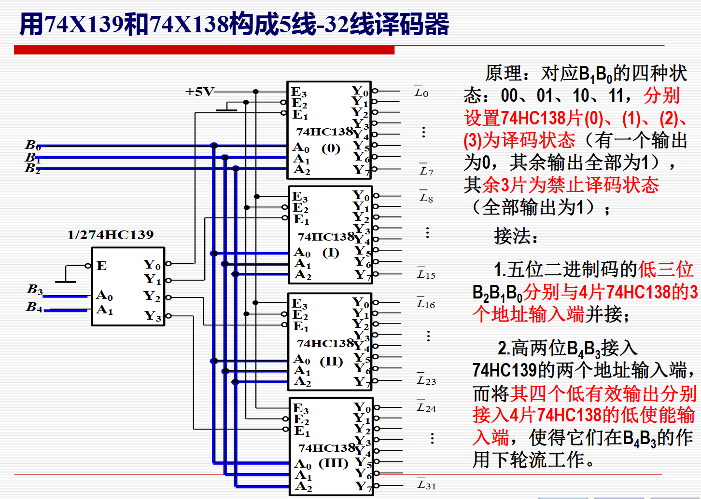
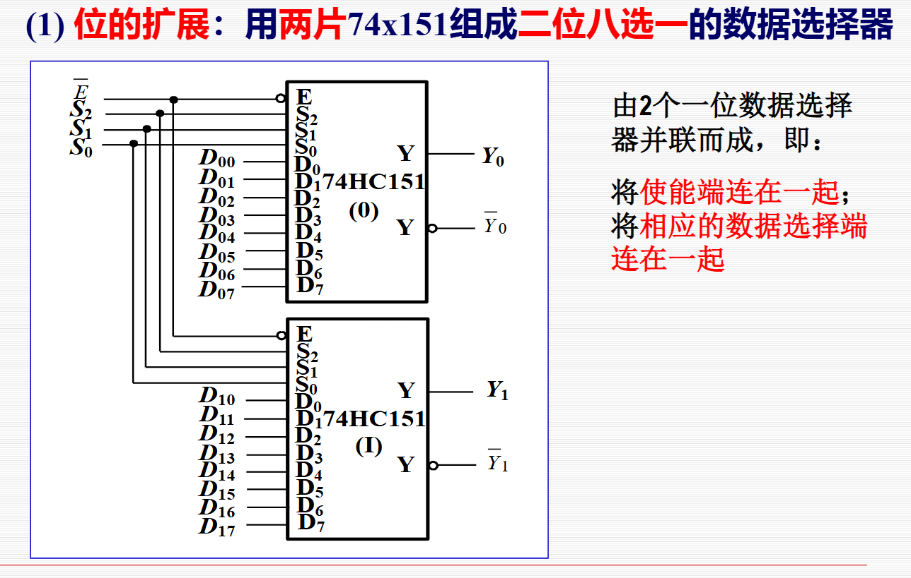
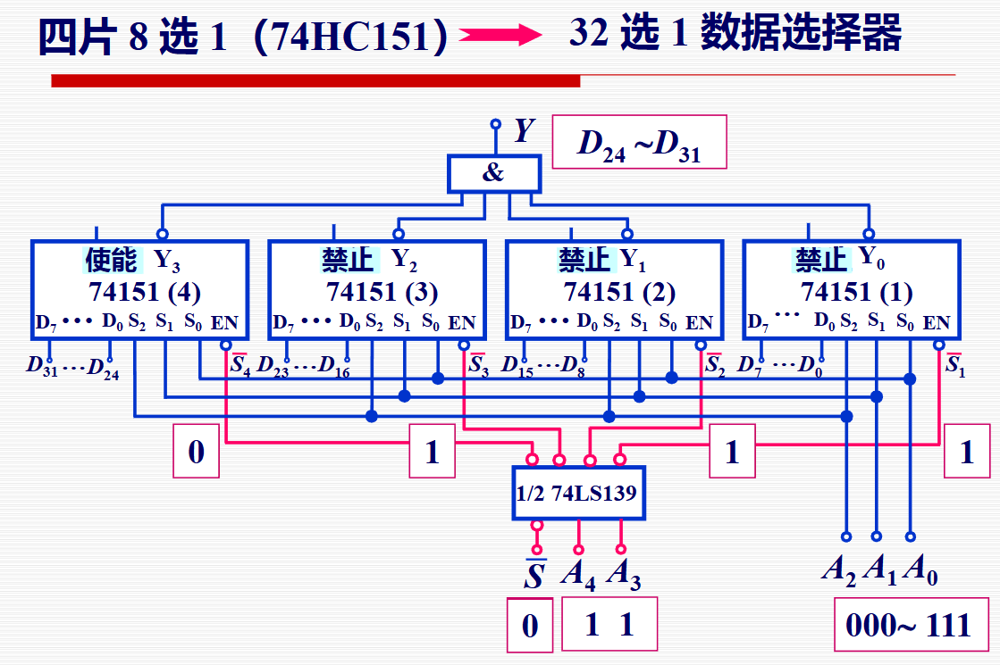
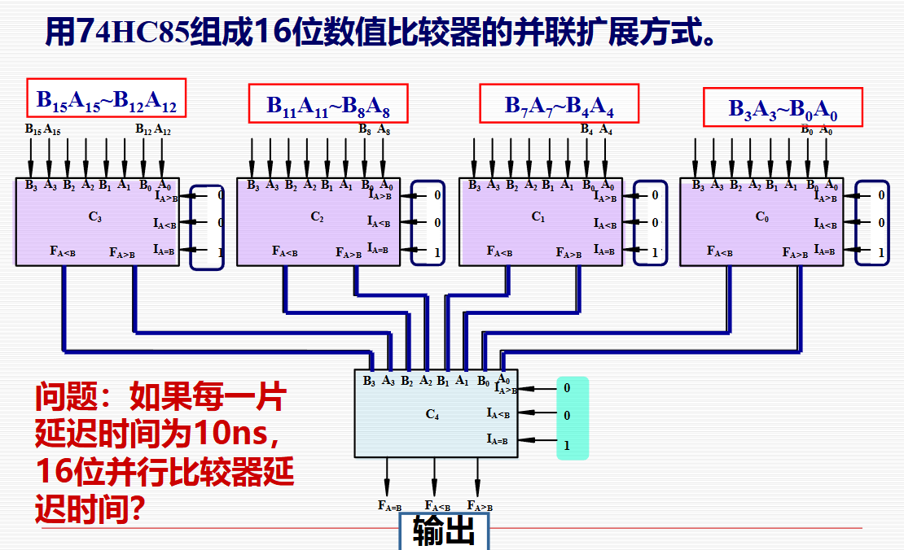

# 典型组合逻辑芯片详解

## 1. CD4532 (8线-3线优先编码器)

### 基本功能
- 8输入线(I0-I7)到3输出线(Y0-Y2)的优先编码
- 当多个输入同时有效时，按优先级顺序(高→低：I7→I0)只对优先级最高的一个输入进行编码

### 引脚功能
- **输入端**：I0-I7 (I7优先级最高)
- **输出端**：Y0-Y2 (二进制编码输出)
- **控制端**：
  - EI (Enable Input)：输入使能端
  - EO (Enable Output)：输出使能端
  - GS (Group Select)：工作状态标志位

### 工作特性
- **EI=0**：禁止编码，所有输出为0，EO=0，GS=0
- **EI=1**：
  - 所有输入为0：EO=1，GS=0
  - 至少一个输入为1：EO=0，GS=1
- **EO端**：用于多片级联，实现更高位数的编码器

### 应用场景
- 键盘编码器
- 多设备请求系统
- 16线-4线优先编码器(两片级联)
- 任何需要识别最高优先级请求的场合

## 2. 74HC138 (3线-8线译码器)

### 基本功能
- 3位二进制码(A0-A2)译码为8个互斥输出(Y0-Y7)
- 每组输入代码对应唯一一个有效输出(低电平有效)

### 引脚功能
- **输入端**：A0-A2 (地址输入)
- **输出端**：Y0-Y7 (低电平有效)
- **使能端**：E1, E2, E3
  - 有效条件：E3=1, E2=0, E1=0

### 工作特性
- 使能端有效时，输出表达式：
  ```
  Y0 = E·A2'·A1'·A0'
  Y1 = E·A2'·A1'·A0
  ...
  Y7 = E·A2·A1·A0
  ```
- 当使能端无效时，所有输出均为高电平
- 包含3个变量的所有最小项

### 应用场景
- **逻辑函数实现**：在输出端连接与非门，可实现3变量逻辑函数
- **数据分配器**：将一路数据分配到8个通道
- **外设选择**：地址译码，选择不同的设备
- **动态显示控制**：与显示译码器配合，实现多位数字显示
- **扩展应用**：可级联构成4线-16线、5线-32线等更多位数的译码器

## 3. 74HC151 (8选1数据选择器)

### 基本功能
- 8个数据通道(D0-D7)中选择1个连接到输出端
- 通过3位选择信号(S0-S2)确定选择哪个通道

### 引脚功能
- **数据输入**：D0-D7
- **地址输入**：S0-S2
- **使能端**：E (低电平有效)
- **输出端**：Y (正常输出)、W (互补输出)

### 工作特性
- 当E=1时，Y=0
- 当E=0时，输出表达式：
  ```
  Y = D0·S2'·S1'·S0' + D1·S2'·S1'·S0 + ... + D7·S2·S1·S0
  ```
- 可看作由3个2选1数据选择器级联构成

### 应用场景
- **位扩展**：多片并联实现多位数据选择
- **字扩展**：级联实现16选1、32选1等更多输入通道
- **逻辑函数实现**：将变量作为地址输入，函数值作为数据输入
- **数据转换**：实现并行到串行的数据转换
- **查找表(LUT)**：构成FPGA的基本单元
- **波形发生器**：产生特定时序波形

## 4. 74HC85 (4位数值比较器)

### 基本功能
- 比较两个4位二进制数A(3:0)和B(3:0)的大小
- 输出三个比较结果：A＞B、A＜B、A=B

### 引脚功能
- **输入端**：A0-A3, B0-B3
- **级联输入**：IA>B, IA<B, IA=B
- **输出端**：FA>B, FA<B, FA=B

### 工作特性
- 当所有级联输入为0-0-1时，只比较本级输入
- 比较原则：
  ```
  FA>B = (A3>B3) + (A3=B3)(A2>B2) + (A3=B3)(A2=B2)(A1>B1) + (A3=B3)(A2=B2)(A1=B1)(A0>B0)
  FA=B = (A3=B3)(A2=B2)(A1=B1)(A0=B0)
  FA<B = (A3<B3) + (A3=B3)(A2<B2) + (A3=B3)(A2=B2)(A1<B1) + (A3=B3)(A2=B2)(A1=B1)(A0<B0)
  ```

### 位数扩展方式
- **串联扩展**：低位片的输出连接到高位片的级联输入
  - 速度: 16位比较器延迟时间 = 4×单片延迟
  - 电路结构简单，但速度较慢
- **并联扩展**：所有高位输入同时连接到各级联输入
  - 速度: 16位比较器延迟时间 ≈ 2×单片延迟
  - 电路复杂，但速度更快

### 应用场景
- 数据比较
- 大小排序
- 阈值检测
- 控制系统中的条件判断

## 5. 74HC283 (4位超前进位加法器)

### 基本功能
- 两个4位二进制数相加，并考虑低位进位
- 采用超前进位技术提高运算速度

### 引脚功能
- **输入端**：A0-A3, B0-B3
- **进位输入**：C-1
- **和输出**：S0-S3
- **进位输出**：CO

### 工作原理
- **关键概念**：
  - 进位产生：Gi = Ai·Bi
  - 进位传递：Pi = Ai⊕Bi
- **进位计算**：
  ```
  C0 = G0 + P0·C-1
  C1 = G1 + P1·G0 + P1·P0·C-1
  C2 = G2 + P2·G1 + P2·P1·G0 + P2·P1·P0·C-1
  C3 = G3 + P3·G2 + P3·P2·G1 + P3·P2·P1·G0 + P3·P2·P1·P0·C-1
  ```
- **和计算**：Si = Pi⊕Ci-1

### 与普通加法器比较
- **串行进位加法器**：每个全加器等待低位进位，速度慢
- **超前进位加法器**：预先计算所有进位，无需等待，速度快

### 应用场景
- **多位加法**：多片级联实现8位、16位等加法器
- **减法运算**：通过加补码实现 A-B = A+(-B) = A+B̅+1
- **码制转换**：如8421BCD码转余3码(输入+0011)
- **算术逻辑单元(ALU)**：作为核心算术部件
- **计数器**：与寄存器配合实现快速计数

## 芯片应用对比表

| 芯片型号 | 主要功能 | 输入/输出 | 关键特性 | 典型应用 |
|---------|---------|----------|----------|---------|
| CD4532 | 8线-3线优先编码器 | 8输入/3输出+3控制 | 优先级处理、可扩展 | 键盘编码、请求系统 |
| 74HC138 | 3线-8线译码器 | 3输入/8输出+3使能 | 最小项发生器 | 逻辑函数实现、数据分配器 |
| 74HC151 | 8选1数据选择器 | 8数据+3地址/1输出 | 多路选择、可扩展 | 数据选择、查找表实现 |
| 74HC85 | 4位数值比较器 | 8数据+3级联/3输出 | 级联比较、两种扩展方式 | 数据比较、排序 |
| 74HC283 | 4位超前进位加法器 | 8数据+1进位/4和+1进位 | 超前进位、高速计算 | 算术运算、码制转换 |

## 设计技巧

1. **芯片级联技术**：
   - CD4532：利用EO和GS信号级联
   - 74HC138：利用使能端级联
   - 74HC151：利用使能端或增加选择线
   - 74HC85：串行/并行两种级联方式
   - 74HC283：低位进位输出连接高位进位输入

2. **功能扩展**：
   - 74HC138可实现数据分配器功能
   - 74HC151可实现逻辑函数，每片可实现最多3变量函数
   - 74HC283可用于减法运算(加补码)

3. **性能优化**：
   - 74HC85：并行扩展比分级扩展速度快
   - 74HC283：超前进位结构比串行进位速度快
   - 合理选择芯片工作模式，避免不必要的延迟

这些芯片构成了数字系统设计的基础，熟练掌握其功能和应用是组合逻辑电路设计的关键。


# 几个实例

## 5线-32线译码器


图片显示了一个使用74HC139和74HC138集成电路芯片构建的5线-32线译码器（也称为5-to-32 decoder）的电路原理图。该译码器是一种数字逻辑电路，用于将5位二进制输入信号（通常表示为地址码）转换为32个互斥的输出信号，其中只有一个输出为有效状态（低电平），其余为无效状态（高电平）。这在数字系统中常用于地址译码、选择信号生成等应用。下面我将先解释图片的内容，然后详细说明该译码器的工作原理。

### 图片内容解释
- **整体标题**："用74X139和74X138构成5线-32线译码器"（使用74X139和74X138构成5线-32线译码器）。这里的"74X"泛指74系列逻辑芯片，实际使用的是74HC139（双2线-4线译码器）和74HC138（3线-8线译码器），HC表示高速度CMOS版本。
- **电路结构**：
  - **输入信号**：5位二进制输入，标记为B₄、B₃、B₂、B₁、B₀（从高位到低位）。这些是地址输入。
  - **芯片组成**：
    - 一个半片74HC139（标记为"1/2 74HC139"，因为74HC139是双2-4译码器，这里只用其中一半），其输入为A₁（连接B₄）和A₀（连接B₃），输出为Y₀、Y₁、Y₂、Y₃（低有效）。
    - 四个74HC138芯片，分别标记为(0)、(1)、(2)、(3)。每个74HC138是3-8译码器，具有地址输入A₂、A₁、A₀，使能输入E₃、E₂、E₁（部分使能高有效，部分低有效，但图片中重点是低有效使能），输出Y₀~Y₇（低有效）。
  - **连接方式**：
    - 高两位输入B₄和B₃连接到74HC139的地址输入A₁和A₀。
    - 74HC139的四个输出Y₀~Y₃分别连接到四个74HC138的低有效使能端E（图片中标记为E）。
    - 低三位输入B₂、B₁、B₀并联连接到所有四个74HC138的地址输入A₂、A₁、A₀。
    - 电源：+5V供电，接地（隐含）。
    - 输出：总共32个输出，标记为L₀~L₃₁（或Y₀~Y₃₁），由四个74HC138的输出组合而成。每个74HC138提供8个输出，4×8=32。
- **附加说明文本**（图片右侧红色文字）：
  - 原理：对应B₁B₀的四种状态（00、01、10、11），分别放置74HC138片(0)、(1)、(2)、(3)的译码状态（有一个输出为0，其余输出全部为1），其余3片为禁止译码状态（全部输出为1）。
  - 方法：
    1. 五位二进制码的低三位B₂B₁B₀分别与4片74HC138的3个地址输入端连接。
    2. 高两位B₄B₃接入74HC139的两个地址输入端，而将其四个低有效输出分别接入4片74HC138的低有效能输入端，使得到它们在B₄B₃的作用下轮流工作。
- **图示细节**：图片分为上、下两部分。上部显示74HC139（完整片）和一个74HC138的引脚；下部显示半个74HC139和更多74HC138的连接。输出被分组为I₀~I₇、I₈~I₁₅等，对应不同芯片的Y输出。整体是一个级联结构，使用2-4译码器选择哪个3-8译码器激活。

图片本质上是该电路的简化示意图，省略了部分使能端（如74HC138的其他使能引脚E₁、E₂，可能固定为有效状态）和VCC/GND连接，但足以说明核心逻辑。

### 该译码器的详细工作原理
这是一个级联译码器设计，利用一个2线-4线译码器（74HC139的一部分）来"选择"四个3线-8线译码器（74HC138）中的一个，从而实现5位输入（2+3=5）到32位输出（4×8=32）的译码。译码器的核心是根据输入的二进制值，使对应的唯一输出线变为低电平（有效），其他输出保持高电平（无效）。这是一种"one-hot"编码输出。

#### 1. **芯片基本特性**
   - **74HC139（双2-4译码器）**：
     - 输入：2位地址A₁A₀，使能G（低有效，图片中可能固定低）。
     - 输出：4位Y₃~Y₀，低有效（即当选中时输出0，否则1）。
     - 真值表（简化）：
       - A₁A₀ = 00 → Y₀=0, 其他Y=1
       - A₁A₀ = 01 → Y₁=0, 其他Y=1
       - A₁A₀ = 10 → Y₂=0, 其他Y=1
       - A₁A₀ = 11 → Y₃=0, 其他Y=1
     - 这里只用一半芯片，作为2-4译码。
   - **74HC138（3-8译码器）**：
     - 输入：3位地址A₂A₁A₀，使能E₃（高有效）、E₂E₁（低有效）。图片中重点使用低有效使能E（对应E₁或E₂）。
     - 输出：8位Y₇~Y₀，低有效。
     - 当使能有效时，根据A₂A₁A₀选择一个Y输出为0，其他为1。
     - 当使能无效时，所有Y输出为1（禁止译码）。
     - 真值表（简化，假设使能有效）：
       - A₂A₁A₀ = 000 → Y₀=0, 其他=1
       - A₂A₁A₀ = 001 → Y₁=0, 其他=1
       - ... 
       - A₂A₁A₀ = 111 → Y₇=0, 其他=1

#### 2. **电路工作流程**
   - **输入处理**：
     - 高两位B₄B₃作为"组选择"，输入到74HC139的A₁A₀。
     - 低三位B₂B₁B₀作为"组内选择"，并联输入到所有四个74HC138的A₂A₁A₀。
   - **步骤1: 高位译码（组选择）**：
     - 74HC139根据B₄B₃产生一个低有效输出：
       - 如果B₄B₃=00，Y₀=0（选中第(0)个74HC138），其他Y=1。
       - 如果B₄B₃=01，Y₁=0（选中第(1)个74HC138）。
       - 如果B₄B₃=10，Y₂=0（选中第(2)个74HC138）。
       - 如果B₄B₃=11，Y₃=0（选中第(3)个74HC138）。
     - 这个Y输出连接到对应74HC138的低有效使能端E，使该芯片启用（允许译码），而其他三个74HC138的E=1（高电平），导致它们被禁止，所有输出Y=1。
   - **步骤2: 低位译码（组内选择）**：
     - 被选中的74HC138接收B₂B₁B₀作为地址，根据其值使一个输出Y为0，其他7个Y为1。
     - 未选中的74HC138所有输出保持1。
   - **整体输出**：
     - 总输出L₃₁~L₀对应四个74HC138的Y输出拼接：
       - L₀~L₇：来自(0)芯片（对应B₄B₃=00）
       - L₈~L₁₅：来自(1)芯片（对应B₄B₃=01）
       - L₁₆~L₂₃：来自(2)芯片（对应B₄B₃=10）
       - L₂₄~L₃₁：来自(3)芯片（对应B₄B₃=11）
     - 对于任意5位输入N（二进制B₄B₃B₂B₁B₀，十进制0~31），只有L_N为0，其他31个输出为1。
     - 示例：
       - 输入00000（0）：B₄B₃=00 → 选中(0)芯片；B₂B₁B₀=000 → Y₀=0 → L₀=0，其他=1。
       - 输入01001（9）：B₄B₃=01 → 选中(1)芯片；B₂B₁B₀=001 → Y₁=0 → L₉=0（L₈是Y₀，L₉是Y₁），其他=1。
       - 输入11111（31）：B₄B₃=11 → 选中(3)芯片；B₂B₁B₀=111 → Y₇=0 → L₃₁=0，其他=1。

#### 3. **注意事项和优势**
   - **使能控制**：74HC138有多个使能端，图片中假设其他使能固定为有效（例如E₃=1，E₂=0，如果适用）。实际构建时需确保。
   - **低有效输出**：所有输出都是低有效（active-low），适合许多数字系统（如内存地址选择）。
   - **扩展性**：这种级联设计可扩展到更大译码器，例如用更多级实现6-64等。
   - **优势**：节省芯片（一个2-4 + 四个3-8代替一个大译码器），逻辑简单，功耗低。
   - **潜在问题**：如果输入超过31（但5位最大31），无额外输出；需注意时序延迟（HC系列较快）。

## 两位八选一数据选择器


### 图片内容解释
这张图片展示了一个使用两片74HC151集成电路芯片构成的三位八选一数据选择器（也称为3-to-8 multiplexer，简称MUX或多路复用器）的电路原理图。该电路是一种数字逻辑电路，用于根据3位二进制选择信号（地址码）从8个数据输入中选择一个输出。具体来说，它扩展了标准74HC151的功能，使其能够处理2位宽的数据通道（即每个输入数据是2位的）。图片分为电路图和说明文本两部分，整体标题为“(1) 位的扩展：用两片74x151组成三位八选一的数据选择器”（这里的“位的扩展”可能指数据位的扩展，使用74系列芯片，HC表示高速度CMOS版本）。

- **电路结构**：
  - **输入信号**：
    - 选择线：S₂、S₁、S₀（3位二进制选择信号，从高到低）。
    - 使能端：Ē（低有效使能，图片中标记为E，反杠表示低有效）。
    - 数据输入：总共16个单位输入，分成两组：
      - 第一组（低位数据）：D₀₀、D₀₁、D₀₂、D₀₃、D₀₄、D₀₅、D₀₆、D₀₇（连接到第一个74HC151芯片，标记为(0)）。
      - 第二组（高位数据）：D₁₀、D₁₁、D₁₂、D₁₃、D₁₄、D₁₅、D₁₆、D₁₇（连接到第二个74HC151芯片，标记为(1)）。
    - 这些数据输入可以视为8个2位数据的并行输入，例如第i个数据为(D₁ᵢ, D₀ᵢ)，i=0~7。
  - **芯片组成**：
    - 两个74HC151芯片，每个是标准的8输入1输出多路复用器（3位选择）。
    - 第一个芯片(0)：输入D₀₀~D₀₇，选择线S₂~S₀，使能Ē；输出Y（标记为Y₀）和反相输出Ȳ（标记为Ȳ₀）。
    - 第二个芯片(1)：输入D₁₀~D₁₇，选择线S₂~S₀（与第一个共享），使能Ē（共享）；输出Y（标记为Y₁）和反相输出Ȳ（标记为Ȳ₁）。
  - **连接方式**：
    - 选择线S₂、S₁、S₀并联连接到两个芯片的相应引脚（S₂、S₁、S₀）。
    - 使能端Ē并联连接到两个芯片的使能引脚（低有效）。
    - 数据输入按位分组：低位组到芯片(0)，高位组到芯片(1)。
    - 输出：两个Y输出（Y₀和Y₁）组合成2位输出，同样有两个反相输出Ȳ₀和Ȳ₁（可用于差分信号或进一步逻辑）。
    - 电源和接地：隐含+5V VCC和GND，未显示。
- **附加说明文本**（图片右侧红色文字）：
  - “由2个一位数据选择器扩展而成，即：将使能端连在一起，将相应的数据选择端连在一起，选在起。”（文字略有残缺，但意思是：通过并联使能端、选择端，并对应连接数据输入，来扩展成多位数据选择器。）
  - “将使能端连在一起，相应的数据选择端连在一起，将在起。”（重复强调连接方式。）
  - “将使能端连在一起；相应的数据选择端连在一起；选在起。”（可能为“选择端连在一起”的简写。）
- **图示细节**：电路图分为上下两部分，上部是芯片(0)的连接（D₀₀~D₀₇到S，输出Y₀/Ȳ₀），下部是芯片(1)的连接（D₁₀~D₁₇到S，输出Y₁/Ȳ₁）。整体是一个并行扩展结构，强调通过共享控制信号实现多位数据的同步选择。

图片本质上是该电路的简化示意图，省略了芯片的完整引脚（如VCC、GND和其他未用引脚），但突出了扩展原理。这在数字系统中常用于数据总线选择、信号路由等应用。

### 该选择器的详细工作原理
这是一个多位数据选择器（multiplexer），基于标准74HC151芯片的并行扩展设计。标准74HC151是一个1位宽的8选1多路复用器（3位选择线，选择8个输入中的一个输出）。这里使用两个这样的芯片并行操作，实现一个2位宽的8选1多路复用器（即选择8个2位数据中的一个，输出2位结果）。这种扩展方法可以推广到更多位（如n位数据用n个1位MUX并行）。

#### 1. **芯片基本特性**
   - **74HC151（8输入1输出多路复用器）**：
     - 输入：3位选择线S₂S₁S₀（二进制地址0~7），8个数据输入D₇~D₀，使能Ē（低有效：低电平时启用，高电平时输出高阻或固定）。
     - 输出：Y（正常输出，选择的数据）和Ȳ（反相输出，非选择的反）。
     - 当Ē=0（启用）时，Y = D_k，其中k = S₂S₁S₀的十进制值；Ȳ = NOT(Y)。
     - 当Ē=1（禁止）时，Y=0，Ȳ=1（或根据 datasheet，可能为高阻，但HC系列通常固定）。
     - 真值表（简化，Ē=0时）：
       | S₂ | S₁ | S₀ | Y   |
       |----|----|----|-----|
       | 0  | 0  | 0  | D₀ |
       | 0  | 0  | 1  | D₁ |
       | 0  | 1  | 0  | D₂ |
       | 0  | 1  | 1  | D₃ |
       | 1  | 0  | 0  | D₄ |
       | 1  | 0  | 1  | D₅ |
       | 1  | 1  | 0  | D₆ |
       | 1  | 1  | 1  | D₇ |
     - Ȳ总是Y的反相。

#### 2. **电路工作流程**
   - **输入处理**：
     - 假设输入数据是8个2位值：Data_i = (D₁ᵢ, D₀ᵢ)，i=0~7（例如，Data_0 = (D₁₀, D₀₀)）。
     - 选择信号S₂S₁S₀（3位二进制，值k=0~7）决定选择哪个Data_k。
     - 使能Ē控制整个电路：如果Ē=1，输出固定（Y₀=Y₁=0，Ȳ₀=Ȳ₁=1）；如果Ē=0，正常工作。
   - **步骤1: 共享控制信号**：
     - 两个74HC151共享相同的S₂S₁S₀和Ē，因此它们同步选择相同的输入索引k。
   - **步骤2: 并行选择数据**：
     - 芯片(0)（低位）：根据S₂S₁S₀选择D₀ₖ，输出到Y₀ = D₀ₖ，Ȳ₀ = NOT(D₀ₖ)。
     - 芯片(1)（高位）：同时根据相同的S₂S₁S₀选择D₁ₖ，输出到Y₁ = D₁ₖ，Ȳ₁ = NOT(D₁ₖ)。
     - 组合输出：Y = (Y₁, Y₀) = Data_k = (D₁ₖ, D₀ₖ)。
     - 反相输出：Ȳ = (Ȳ₁, Ȳ₀) = NOT(Data_k)。
   - **整体输出**：
     - 对于任意选择k（S₂S₁S₀的十进制），输出直接是选择的2位数据。
     - 示例：
       - S₂S₁S₀=000 (k=0)，Ē=0：Y₀ = D₀₀, Y₁ = D₁₀；输出( D₁₀, D₀₀ )。
       - S₂S₁S₀=001 (k=1)，Ē=0：Y₀ = D₀₁, Y₁ = D₁₁；输出( D₁₁, D₀₁ )。
       - S₂S₁S₀=111 (k=7)，Ē=0：Y₀ = D₀₇, Y₁ = D₁₇；输出( D₁₇, D₀₇ )。
       - 如果Ē=1：无论选择线如何，Y₀=Y₁=0，Ȳ₀=Ȳ₁=1。
     - 反相输出可用于需要互补信号的场合，如差分传输或进一步逻辑门。

#### 3. **注意事项和优势**
   - **使能控制**：Ē低有效，确保电路只在需要时激活，节省功耗。
   - **扩展性**：这种并行方法简单高效，对于m位宽的8选1 MUX，只需m个74HC151芯片共享控制线。
   - **优势**：利用现成芯片实现多位MUX，无需自定义逻辑；速度快（HC系列延迟小）；易于进一步扩展（如用更多芯片到4位等）。
   - **潜在问题**：数据输入必须正确分组；如果需要更多通道，可级联更多MUX，但这里是位扩展而非通道扩展。实际构建时需连接VCC/GND，并注意扇出/扇入限制。
   - **与单芯片区别**：标准74HC151只处理1位；这里扩展到2位，适用于多位数据总线。


## 四片八选一的三十二选一数据选择器

这张图片展示了一个使用四片74HC151集成电路芯片（每个是8选1多路复用器）和半个74LS139芯片（2线-4线译码器）构成的32选1数据选择器（32-to-1 multiplexer，也称为数据选择器或MUX）的电路原理图。该电路是一种数字逻辑电路，用于根据5位二进制选择信号（地址码S₄ S₃ S₂ S₁ S₀）从32个数据输入（D₀~D₃₁）中选择一个输出到Y。图片强调这是通道扩展（从8选1扩展到32选1），常用于数字系统中如数据路由、信号选择或多路数据总线。标题为“四片8选1 (74HC151) → 32选1 数据选择器”（四片8选1 (74HC151) → 32选1 数据选择器）。注意，芯片标注为74HC151，但下部译码器为74LS139（LS系列是TTL逻辑，HC是CMOS，可能为兼容性考虑；实际构建时需注意电平匹配）。
### 图片内容解释
- **电路结构**：
  - **输入信号**：
    - 数据输入：32位D₃₁~D₀，分成四组，每组8位连接到一个74HC151。
      - 最右组（低位）：D₇~D₀ 连接到74LS151 (1)（图片中标记为74LS151，但标题为74HC151，可能笔误）。
      - 下一组：D₁₅~D₈ 连接到74LS151 (2)。
      - 下一组：D₂₃~D₁₆ 连接到74LS151 (3)。
      - 最左组（高位）：D₃₁~D₂₄ 连接到74LS151 (4)。
    - 选择线：5位S₄~S₀（从高到低）。
    - 使能端：EN（低有效或高有效，取决于芯片；图片中连接到译码器的S，可能为使能）。
  - **芯片组成**：
    - 四个74HC151芯片，每个是8输入1输出多路复用器，具有选择输入S₂ S₁ S₀、使能EN（图片中EN为低有效）、数据输入D₇~D₀、输出Y。
    - 一个半片74LS139（1/2 74LS139，双2-4译码器，只用一半），输入A₄ A₃（高位选择）、S（使能，低有效？），输出四个低有效信号（连接到每个74HC151的EN）。
  - **连接方式**：
    - 高两位选择S₄ S₃连接到74LS139的地址输入A₄ A₃（图片中A₄ A₃）。
    - 低三位选择S₂ S₁ S₀并联连接到所有四个74HC151的S₂ S₁ S₀。
    - 74LS139的四个输出（低有效）分别连接到四个74HC151的使能端EN（假设EN低有效启用）。
    - 整体使能EN连接到74LS139的S（使能输入）。
    - 输出：四个74HC151的Y输出需要组合成最终Y（图片中未明确显示组合门，但标准设计中通过或门（OR）连接，因为禁用时Y=0）；顶部有“Y & D₂₄~D₃₁”，但这可能是个标注错误或表示最终输出逻辑，实际为OR。
    - 电源和接地：隐含+5V VCC和GND，未显示。
- **图示细节**：电路图分为上、下两部分。上部显示四个74HC151的并行排列，每组数据输入和共享的低位选择线，下部显示74LS139的连接，并以示例状态展示：当A₄ A₃=11（或特定值）时，一个输出为0（启用对应MUX），其他为1（禁用）；A₂ A₁ A₀=000~111表示低位选择范围。红色线表示信号流，底部有“0 1 1 000~111”等值作为示例输入/输出状态。
- **附加说明**：无额外文本，但图片通过示例值（如0连接到左MUX的EN，1到其他）说明译码选择逻辑。

图片本质上是该电路的简化示意图，省略了最终输出组合门（或门）和完整引脚（如反相输出Ȳ，可能未用），但突出了级联扩展原理。这是一种典型的MUX扩展设计，利用译码器选择组。

### 该选择器的详细工作原理
这是一个通道扩展的多路复用器设计，利用一个2线-4线译码器（74LS139的一部分）来“选择”四个8选1多路复用器（74HC151）中的一个，从而实现32位输入（4×8=32）到1位输出的选择。根据5位选择信号S₄~S₀（二进制值0~31），输出Y等于选中的D_k（k=S的十进制值）。这种设计常用于当标准芯片通道不足时，通过级联扩展。

#### 1. **芯片基本特性**
   - **74HC151（8选1多路复用器）**：
     - 输入：3位选择S₂ S₁ S₀、8位数据D₇~D₀、使能EN（低有效：低电平时启用）。
     - 输出：Y（选中数据）和Ȳ（反相，未用）。
     - 当EN=0（启用）时，Y = D_k，其中k = S₂ S₁ S₀的十进制（0~7）。
     - 当EN=1（禁用）时，Y=0（固定）。
     - 真值表同前述74HC151。
   - **74LS139（双2-4译码器）**：
     - 输入：2位地址A₁ A₀（这里A₄ A₃）、使能G（低有效S）。
     - 输出：4位低有效（选中时0，否则1）。
     - 当G=0时，根据A₁ A₀使一个输出为0，其他为1。
     - 真值表：
       - A₁ A₀ = 00 → 输出0=0，其他=1
       - 01 → 输出1=0，其他=1
       - 10 → 输出2=0，其他=1
       - 11 → 输出3=0，其他=1
     - 当G=1时，所有输出=1（禁用）。

#### 2. **电路工作流程**
   - **输入处理**：
     - 高两位S₄ S₃作为“组选择”，输入到74LS139的A₄ A₃。
     - 低三位S₂ S₁ S₀作为“组内选择”，并联到所有四个74HC151。
     - 整体使能EN连接到74LS139的S：如果EN=1（假设低有效，则禁用整个电路，Y=0）；EN=0正常工作。
   - **步骤1: 高位译码（组选择）**：
     - 74LS139根据S₄ S₃产生一个低有效输出：
       - S₄ S₃=00 → 启用第一个MUX (1)，其EN=0，其他EN=1。
       - S₄ S₃=01 → 启用第二个MUX (2)。
       - S₄ S₃=10 → 启用第三个MUX (3)。
       - S₄ S₃=11 → 启用第四个MUX (4)。
     - 被选中的MUX启用（EN=0），允许其根据低位选择数据；未选中的MUX禁用，Y=0。
   - **步骤2: 低位译码（组内选择）**：
     - 被选中的74HC151根据S₂ S₁ S₀选择其组内的D：Y = D_{基址 + k}，其中k=S₂ S₁ S₀的十进制，基址为组起始（例如第一组基址0，第二组8等）。
     - 未选中的MUX输出Y=0。
   - **步骤3: 输出组合**：
     - 四个MUX的Y输出通过或门（OR）组合成最终Y（图片未显示，但逻辑必要）：因为只有一个Y非0，其他为0，最终Y=选中的D。
     - 如果使用wired-OR（有线或，适用于开漏输出），可直接连接Y到公共线。
   - **整体输出**：
     - 对于5位选择N（S₄~S₀，二进制0~31），Y = D_N。
     - 示例（假设EN=0启用）：
       - S=00000 (0)：S₄ S₃=00 → 启用MUX(1)；S₂ S₁ S₀=000 → Y=D₀；其他MUX Y=0 → 最终Y=D₀。
       - S=01001 (9)：S₄ S₃=01 → 启用MUX(2)；S₂ S₁ S₀=001 → Y=D₉（第二组D₈=D₀ of MUX2, D₉=D₁）；最终Y=D₉。
       - S=11111 (31)：S₄ S₃=11 → 启用MUX(4)；S₂ S₁ S₀=111 → Y=D₃₁；最终Y=D₃₁。
       - 如果EN=1：所有MUX禁用，Y=0。

#### 3. **注意事项和优势**
   - **使能控制**：整体EN控制电路激活；每个MUX的EN由译码器管理，确保互斥。
   - **逻辑电平**：74LS139 (TTL) 与74HC151 (CMOS) 混用，需注意电压兼容（HC可兼容TTL输出）。
   - **扩展性**：可进一步扩展（如用3-8译码器到64选1）。
   - **优势**：利用现成芯片实现大通道MUX，成本低；禁用MUX节省功耗。
   - **潜在问题**：未显示的OR门需添加（可用74HC32）；时序延迟（译码+ MUX）；如果EN高有效，需调整逻辑。

## 74HC85组成十六位数值比较器的并联扩展方式

### 图片内容解释
这张图片展示了一个使用四片74HC85集成电路芯片（每个是4位幅度比较器，magnitude comparator）级联构成的16位数字比较器（16-bit comparator）的电路原理图。该电路是一种数字逻辑电路，用于比较两个16位二进制数A（A15~A0）和B（B15~B0），并输出比较结果：A > B、A = B 或 A < B。图片强调这是“并联扩展方式”（但实际是级联扩展，"并联"可能指位并行处理，而控制信号级联；这在数字设计中常见，用于扩展比较器位宽）。电路图分为上、下两部分，上部显示四个74HC85芯片的级联连接，下部提出一个问题。

- **电路结构**：
  - **输入信号**：
    - 两个16位数：A15~A0 和 B15~B0，分成四组4位输入，每组连接到一个74HC85芯片。
      - 最左芯片（C3，高位）：B15 A15 ~ B12 A12（MSB，最显著位）。
      - 下一芯片（C2）：B11 A11 ~ B8 A8。
      - 下一芯片（C1）：B7 A7 ~ B4 A4。
      - 最右芯片（C0，低位）：B3 A3 ~ B0 A0（LSB，最低显著位）。
    - 每个芯片有级联输入（IA>B、IA=B、IA<B），用于连接前一级的结果。
  - **芯片组成**：
    - 四个74HC85芯片（标记为C3、C2、C1、C0），每个处理4位比较。
    - 级联方式：最低位芯片C0的级联输入固定（图片显示示例值，如IA>B=1、IA=B=0、IA<B=1，但标准为IA=B=1、IA>B=0、IA<B=0，表示起始假设“前级相等”）。
    - 输出：每个芯片有QA>B、QA=B、QA<B（图片显示示例值，如0或1）。
  - **连接方式**：
    - 数据输入A和B按位分组并行连接到每个芯片的A3~A0和B3~B0。
    - 级联信号：C0的输出QA>B、QA=B、QA<B 连接到C1的输入IA>B、IA=B、IA<B；C1输出到C2；C2到C3。
    - 最终输出：从最高位芯片C3的QA>B、QA=B、QA<B 输出整体结果（图片中标记为最终输出端）。
    - 电源和接地：隐含VCC（+5V）和GND，未显示。
- **图示细节**：电路图以树形/链状显示级联，每个芯片块显示输入位、内部比较（F A>B 等，可能表示函数或固定值，如F表示false/low）、和输出值（0或1作为示例）。底部有一个额外块C4（可能表示最终逻辑或示例），输入B3 A3 等=0，输出QA>B=0 等。红色框突出位分组。
- **附加问题**（图片底部红色文字）："问题：如果每一片延迟时间为10ns，16位并行比较器延迟时间？"（如果每一片延迟时间为10ns，16位并行比较器延迟时间？）。这暗示计算级联延迟。

图片本质上是该电路的简化示意图，省略了完整引脚（如VCC、GND）和实际门电路，但突出了级联扩展原理。这在数字系统中常用于 ALU（算术逻辑单元）、优先级编码或数据排序等应用。示例值（如0、1）可能用于说明特定输入下的输出状态。

### 该比较器的详细工作原理
这是一个级联幅度比较器设计，利用四个4位比较器（74HC85）串联扩展到16位宽度。比较器的工作是逐位比较两个二进制数A和B，从最高位（MSB）开始优先判断：如果高位不相等，直接决定结果；如果相等，则检查下一位，直至最低位（LSB）。级联允许结果从低位芯片传播到高位芯片，确保整体一致性。输出是互斥的：只有一个输出为高电平（有效），表示A > B、A = B 或 A < B。

#### 1. **基本操作（单片74HC85）**
   - 每个74HC85比较两个4位数A (A3~A0) 和 B (B3~B0)，并考虑级联输入 (IA>B, IA=B, IA<B)。
   - 比较逻辑：
     - 从最高位 (A3 vs B3) 开始。
     - 如果 A3 > B3，则忽略低位，输出 QA>B = 1（高），QA=B = 0，QA<B = 0。
     - 如果 A3 < B3，则 QA<B = 1，其他为0。
     - 如果 A3 = B3，则检查 A2 vs B2，以此类推。
     - 如果所有位相等，则 QA=B = 1，其他为0。
   - 级联输入的作用：表示“前级（更低位）”的结果。
     - 如果 IA=B = 1（前级相等），则基于当前4位比较决定输出。
     - 如果 IA>B = 1（前级 A > B），则强制 QA>B = 1，无论当前位。
     - 如果 IA<B = 1，则强制 QA<B = 1。
   - 输出总是互斥（只有一个为1），适用于二进制、BCD或其他单调码。

#### 2. **级联扩展到16位**
   - **链式连接**：从最低位芯片 (C0) 开始，到最高位 (C3)。
     - 最低位芯片 (C0) 的级联输入固定为：IA=B = 1（高，假设“无更低位，相等”），IA>B = 0，IA<B = 0。这启动链条。
     - C0 输出 (QA>B, QA=B, QA<B) 连接到 C1 的输入 (IA>B, IA=B, IA<B)。
     - 类似地，C1 到 C2，C2 到 C3。
     - 最终结果从 C3 的输出 (QA>B, QA=B, QA<B) 取出。
   - **整体比较流程**：
     - 电路比较 A15~A0 和 B15~B0。
     - 实际比较从 MSB (A15 vs B15 in C3) 优先，但信号传播从 LSB (C0) 开始：C0 先比较低4位，如果相等 (QA=B=1)，则允许 C1 比较下一组；如果 C0 已决定 (e.g., QA>B=1)，则传播到更高位，强制结果。
     - 示例：
       - 假设 A = 0001 0000 0000 0001 (十进制 4097)，B = 0001 0000 0000 0000 (十进制 4096)。
         - C0 (低4位): A3~0=0001 > B=0000 → QA>B=1, QA=B=0, QA<B=0。
         - 此结果传播到 C1: IA>B=1 → C1 强制 QA>B=1（忽略其位）。
         - 类似传播到 C2 和 C3 → 最终 QA>B=1 (A > B)。
       - 如果所有位相等，则全程 QA=B=1 传播，最终 QA=B=1。
     - 这确保了 MSB 优先，但通过级联实现无外部门。
   - **并联 vs 级联**：图片称“并联扩展”，但数据位是并行输入，控制 (级联) 是串行传播。这不同于纯树形结构（真正并行，延迟更低，但需更多逻辑）。

#### 3. **延迟计算（针对图片问题）**
   - 每个74HC85的典型传播延迟（数据输入到输出）约为13ns（VCC=5V, CL=15pF, 25°C），但图片给出每片10ns（可能简化或特定条件）。
   - 在级联中，延迟累加：信号必须通过每个芯片稳定。
   - 对于4片（16位），总延迟 = 4 × 10ns = 40ns。
   - 额外：转换时间 (tTLH/tTHL) 每片约15-22ns，也累加；但问题简化用10ns/片，故答案40ns。
   - 在高速系统中，累加延迟可能限制时钟频率；树形设计可减至对数级（e.g., 16位 ~4ns 级联 vs log2(16)=4 级 ~常数延迟）。

#### 4. **每个引脚的功能**
基于74HC85数据手册（CD74HC85 等效），标准16引脚DIP/SOIC封装：

- **A0 (引脚5)**: A的最低位输入（LSB for 该芯片）。
- **A1 (引脚7)**: A的次低位输入。
- **A2 (引脚10)**: A的次高位输入。
- **A3 (引脚12)**: A的最高位输入（MSB for 该芯片）。
- **B0 (引脚6)**: B的最低位输入。
- **B1 (引脚9)**: B的次低位输入。
- **B2 (引脚11)**: B的次高位输入。
- **B3 (引脚13)**: B的最高位输入。
- **IA<B (引脚3)**: 级联输入，低有效？ 等待：活跃高；高表示前级 A < B。
- **IA=B (引脚1)**: 级联输入，高表示前级 A = B。
- **IA>B (引脚2)**: 级联输入，高表示前级 A > B。
- **QA<B (引脚4)**: 输出，高表示整体 A < B。
- **QA=B (引脚15)**: 输出，高表示整体 A = B。
- **QA>B (引脚14)**: 输出，高表示整体 A > B。
- **VCC (引脚16)**: 电源供电（HC: 2V~6V；典型5V）。
- **GND (引脚8)**: 接地。

所有输入/输出缓冲，支持扇出（驱动多个负载）。在级联中，最低位 IA=B=高，其他低；未用引脚可浮空，但推荐固定。
