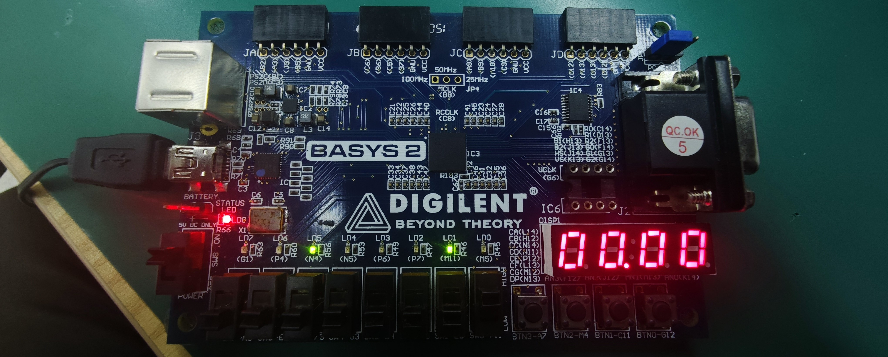
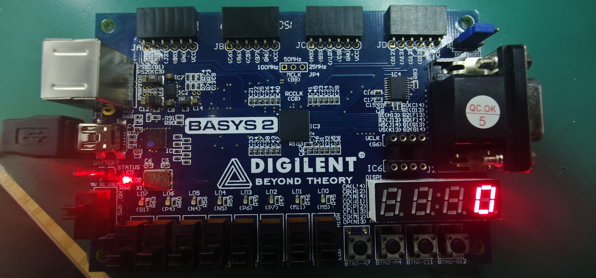
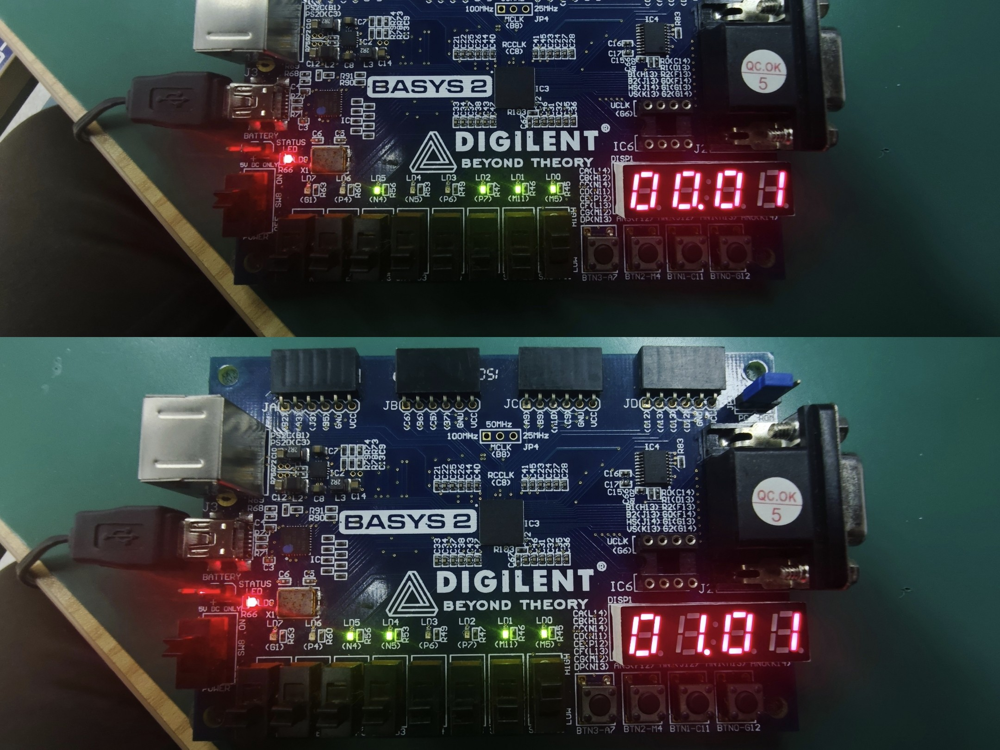
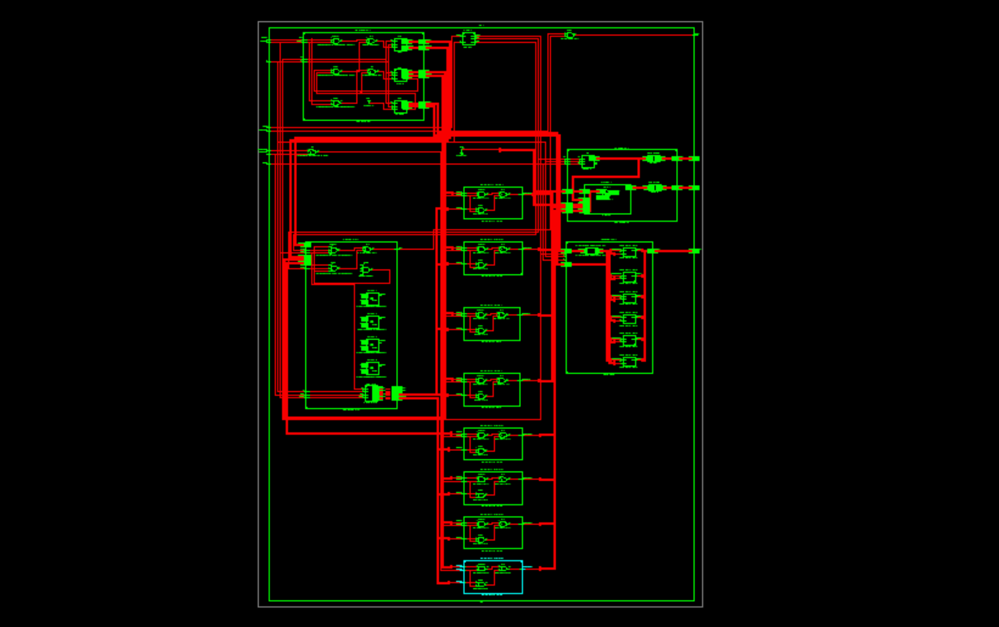

***

# 实验报告：多功能数字钟设计仿真与实现 (实验十八)

**自动化2406 迟泰炎 U202414215**
**日期：2026-03-31**

## 一、实验任务
1. 掌握使用可编程逻辑器件（FPGA）实现数字电路与系统的方法。
2. 掌握Verilog HDL计数类时序逻辑电路的设计与实现。
3. 掌握分层次、分模块的自顶向下电路设计方法。
4. 具体任务：设计并实现一个多功能数字钟电路。
 基本功能：显示时、分（数码管）和秒（LED）。小时为24进制，分、秒为同步60进制。具备异步复位清零功能，并能通过按键手动调整（校准）小时和分钟时间。

## 二、设计平台
(1) 软件设计流程
本实验继续采用Xilinx ISE 14.7作为开发环境。设计流程主要包括：新建工程并指定芯片型号 -> 采用模块化思想建立多个Verilog HDL设计文件（底层计数器、分频器及顶层模块） -> 编写Testbench进行行为级仿真验证 -> 编写UCF约束文件映射物理管脚 -> 综合、实现并生成.bit文件 -> 下载至硬件验证。

(2) 硬件平台简要介绍
采用 Digilent BASYS2 实验开发板。本实验利用板载的 50MHz 有源晶振提供系统时钟，使用拨码开关（SW0）作为异步复位输入，独立按键（BTN0, BTN1）作为校时输入，8个发光二极管（LED）以BCD码形式显示秒，4位一体共阳极数码管动态扫描显示小时和分钟。

## 三、设计源文件及注释
本设计采用层次化、模块化方法。整个系统划分为：分频器模块（divider）、模60计数器模块（counter60，由counter10和counter6构成）、模24计数器模块（counter24）、数码管动态扫描驱动模块（display_driver，本报告略其详表）以及将它们连接起来的顶层模块（top_clock）。

1. 顶层模块 (top_clock.v)
负责实例化各个子模块，处理时钟分频逻辑，并实现进位与校时控制逻辑。
```verilog
module top_clock(
    input clk_50m,      // 50MHz系统时钟
    input nCR,          // 异步复位键 (低电平有效，对应SW0)
    input AdjMinKey,    // 调分按键 (高电平有效，对应BTN0)
    input AdjHrKey,     // 调时按键 (高电平有效，对应BTN1)
    
    output [7:0] Sec,   // 秒显示 (输出到LED)
    output [3:0] AN,    // 数码管位选
    output [7:0] SEG    // 数码管段选
);

    wire clk_1hz;
    reg clk_1khz;
    reg [15:0] cnt_1k;
    
    wire [7:0] Hr_internal;  // 内部连接的小时BCD码
    wire [7:0] Min_internal; // 内部连接的分钟BCD码
    
    wire min_carry, hr_carry;
    wire min_en, hr_en;

    // 1. 产生 1Hz 走时钟 (之前写的divider模块)
    divider U_Div (
        .clk_50m(clk_50m),
        .nCR(nCR),
        .clk_1hz(clk_1hz)
    );

    // 2. 产生 1kHz 扫描时钟 (50MHz / 50000 = 1kHz)
    always @(posedge clk_50m or negedge nCR) begin
        if (~nCR) begin
            cnt_1k <= 0;
            clk_1khz <= 0;
        end else if (cnt_1k >= 16'd24999) begin
            cnt_1k <= 0;
            clk_1khz <= ~clk_1khz;
        end else begin
            cnt_1k <= cnt_1k + 1'b1;
        end
    end

    // 3. 秒计数器
    counter60 U_Sec (
        .Cnt(Sec), 
        .nCR(nCR), 
        .EN(1'b1), 
        .CP(clk_1hz)
    );

    // 进位与校时控制逻辑：
    assign min_carry = (Sec == 8'h59);
    assign min_en = min_carry | AdjMinKey; 

    // 4. 分钟计数器
    counter60 U_Min (
        .Cnt(Min_internal), 
        .nCR(nCR), 
        .EN(min_en), 
        .CP(clk_1hz)
    );

    // 进位与校时控制逻辑：
    assign hr_carry = (Min_internal == 8'h59) && min_carry;
    assign hr_en = hr_carry | AdjHrKey;

    // 5. 小时计数器
    counter24 U_Hr (
        .Cnt(Hr_internal), 
        .nCR(nCR), 
        .EN(hr_en), 
        .CP(clk_1hz)
    );
    
    // 6. 实例化数码管显示驱动
    display_driver U_Display (
        .clk_1khz(clk_1khz),
        .Hr(Hr_internal),
        .Min(Min_internal),
        .AN(AN),
        .SEG(SEG)
    );

endmodule
```

2.counter60.v
采用级联方式，调用底层模10和模6计数器，输出8421 BCD码。
```verilog
module counter60(Cnt, nCR, EN, CP);
    input CP, nCR, EN;
    output [7:0] Cnt;       // 输出为8421 BCD码

    wire ENP;               // 计数器十位的使能信号

    // 计数器的个位 (模10)
    counter10 UC0 (.Q(Cnt[3:0]), .nCR(nCR), .EN(EN), .CP(CP));
    
    // 产生计数器十位的使能信号：个位为9且当前模块被使能时才进位
    assign ENP = EN & (Cnt[3:0] == 4'h9); 
    
    // 计数器的十位 (模6)
    counter6  UC1 (.Q(Cnt[7:4]), .nCR(nCR), .EN(ENP), .CP(CP));
endmodule
```

3.counter10.v

```verilog
module counter10(Q, nCR, EN, CP);
    input CP, nCR, EN;
    output reg [3:0] Q;

    always @(posedge CP or negedge nCR) begin
        if(~nCR) 
            Q <= 4'b0000;          // nCR=0, 异步清零
        else if(~EN) 
            Q <= Q;                // EN=0, 暂停计数
        else if (Q == 4'b1001) 
            Q <= 4'b0000;          // 计满9归零
        else 
            Q <= Q + 1'b1;         // 计数器增1
    end
endmodule
```
4.counter6.v
```verilog
module counter6(Q, nCR, EN, CP);
    input CP, nCR, EN;
    output reg [3:0] Q;

    always @(posedge CP or negedge nCR) begin
        if(~nCR) 
            Q <= 4'b0000;          // nCR=0, 异步清零
        else if(~EN) 
            Q <= Q;                // EN=0, 暂停计数
        else if(Q == 4'b0101) 
            Q <= 4'b0000;          // 计满5归零
        else 
            Q <= Q + 1'b1;         // 计数器增1
    end
endmodule
```

5.counter24.v

```verilog
module counter24(Cnt, nCR, EN, CP);
    input CP, nCR, EN;
    output reg [7:0] Cnt;

    always @(posedge CP or negedge nCR) begin
        if (~nCR) begin
            Cnt <= 8'h00;
        end else if (EN) begin
            if (Cnt == 8'h23) begin
                Cnt <= 8'h00;            // 计满23清零
            end else if (Cnt[3:0] == 4'h9) begin
                Cnt[3:0] <= 4'h0;        // 个位满9，向十位进位
                Cnt[7:4] <= Cnt[7:4] + 1'b1;
            end else begin
                Cnt[3:0] <= Cnt[3:0] + 1'b1; // 个位正常加1
            end
        end
    end
endmodule
```

6.divider.v
```verilog
module divider(
    input clk_50m, 
    input nCR, 
    output reg clk_1hz
);
    reg [24:0] count; // 至少需要25位来存储 25,000,000 的计数值

    always @(posedge clk_50m or negedge nCR) begin
        if (~nCR) begin
            count <= 0;
            clk_1hz <= 0;
        end else if (count == 25000000 - 1) begin
            count <= 0;
            clk_1hz <= ~clk_1hz;  // 计数达到一半时翻转，得到1Hz
        end else begin
            count <= count + 1;
        end
    end
endmodule
```

7.counter60.v
```verilog
module counter60(Cnt, nCR, EN, CP);
    input CP, nCR, EN;
    output [7:0] Cnt;       // 输出为8421 BCD码

    wire ENP;               // 计数器十位的使能信号

    // 计数器的个位 (模10)
    counter10 UC0 (.Q(Cnt[3:0]), .nCR(nCR), .EN(EN), .CP(CP));
    
    // 产生计数器十位的使能信号：个位为9且当前模块被使能时才进位
    assign ENP = EN & (Cnt[3:0] == 4'h9); 
    
    // 计数器的十位 (模6)
    counter6  UC1 (.Q(Cnt[7:4]), .nCR(nCR), .EN(ENP), .CP(CP));
endmodule
```

8.display_driver.v
```verilog
module display_driver(
    input clk_1khz,        // 1kHz 扫描时钟
    input [7:0] Hr,        // 小时 BCD 码
    input [7:0] Min,       // 分钟 BCD 码
    output reg [3:0] AN,   // 4位位选 (低电平有效)
    output reg [7:0] SEG   // 8段段选 (低电平有效，SEG[7]为小数点)
);

    reg [1:0] scan_cnt;    // 2位计数器，用于切换4个数码管
    reg [3:0] current_bcd; // 当前正在显示的 BCD 数字

    // 扫描计数器
    always @(posedge clk_1khz) begin
        scan_cnt <= scan_cnt + 1'b1;
    end

    // 位选信号产生与数据多路选择
    always @(*) begin
        case(scan_cnt)
            2'b00: begin AN = 4'b1110; current_bcd = Min[3:0]; end // 最右侧数码管：分个位
            2'b01: begin AN = 4'b1101; current_bcd = Min[7:4]; end // 右二数码管：分十位
            2'b10: begin AN = 4'b1011; current_bcd = Hr[3:0];  end // 左二数码管：时个位
            2'b11: begin AN = 4'b0111; current_bcd = Hr[7:4];  end // 最左侧数码管：时十位
            default: begin AN = 4'b1111; current_bcd = 4'h0; end
        endcase
    end

    // 七段译码器 (共阳极/低电平点亮，Basys2开发板适用)
    // 对应关系: {DP, CG, CF, CE, CD, CC, CB, CA}
    always @(*) begin
        case(current_bcd)
            4'h0: SEG = 8'b1100_0000;
            4'h1: SEG = 8'b1111_1001;
            4'h2: SEG = 8'b1010_0100;
            4'h3: SEG = 8'b1011_0000;
            4'h4: SEG = 8'b1001_1001;
            4'h5: SEG = 8'b1001_0010;
            4'h6: SEG = 8'b1000_0010;
            4'h7: SEG = 8'b1111_1000;
            4'h8: SEG = 8'b1000_0000;
            4'h9: SEG = 8'b1001_0000;
            default: SEG = 8'b1111_1111; // 熄灭
        endcase
        
        // 可选：在小时和分钟之间点亮小数点作为分隔符
        if (scan_cnt == 2'b10) 
            SEG[7] = 1'b0; // 点亮时个位的小数点
    end

endmodule
```

## 四、硬件引脚约束 (UCF) 与管脚映射

在完成 Verilog 逻辑代码编写后，本实验未进行软件层面的行为仿真，而是直接将虚拟的逻辑信号映射到 BASYS2 开发板的物理管脚上进行实机验证。根据开发板的硬件原理图与分配规划，编写了严格的top_clock.ucf约束文件。

具体的硬件管脚映射关系如下：
1. 系统时钟与复位：50MHz 系统时钟 (clk_50m) 绑定至固定晶振引脚 B8。异步复位清零信号 (nCR) 绑定至拨码开关 SW0 (P11)，低电平有效。使用拨码开关便于长时间维持复位状态 。

2. 校时控制按键：调分按键 (AdjMinKey) 绑定至独立按键 BTN0 (G12)，高电平有效 。调时按键 (AdjHrKey) 绑定至独立按键 BTN1 C11，高电平有效。

3. 显示输出模块：利用开发板上的 8 个发光二极管 (LED0~LED7，管脚 M5~G1) 以 8421 BCD 码的二进制形式直观显示秒针 (00~59) 。用四位一体共阳极数码管。位选信号 AN[3:0] 分别绑定至 K14、M13、J12、F12，从左至右依次显示小时的十位与个位、分钟的十位与个位。段选信号 SEG[7:0] 绑定至对应的物理管脚以驱动数码管笔段发光。

## 五、工程综合与程序下载

在 Xilinx ISE 14.7 环境中，将所有设计文件及.ucf约束文件添加至工程后，执行了完整的硬件编译流程：将 Verilog HDL 逻辑代码转化为底层的网表文件，系统未报告任何语法或逻辑锁存器错误。包含翻译 (Translate)、映射 (Map) 和布局布线 (Place & Route)，将逻辑网表与 UCF 约束文件结合，成功映射到 Spartan-3E (XC3S100E) FPGA 芯片的内部物理资源上。编译生成了用于硬件下载的 .bit 文件。通过 USB 下载线连接开发板，使用相应的下载工具（如 Digilent Adept）将生成的.bit固件烧录至 FPGA 芯片中，准备进行上电实机测试。

## 六、实机硬件测试结果与分析

固件下载完毕后，系统上电，对多功能数字钟的各项设计指标进行了全面的物理按键拨动与视觉观察测试。测试过程及现象如下：

1. 正常走时状态测试
将复位拨码开关 SW0 (P11) 拨至高电平，数字钟开始正常工作。数码管左侧两位正常显示小时（00~23），右侧两位显示分钟（00~59）。下方 8 个 LED 灯作为秒计数器，以 BCD 码的形式每秒规律闪烁递增，当 LED 计满 59（即 `8'h59`）后，下一秒自动清零，同时数码管的分钟位进位加 1。运行稳定，未出现肉眼可见的显示闪烁，说明 1kHz 的动态扫描时钟和 1Hz 的分频走时钟设计完全正确。


1. 异步复位清零测试
在系统正常走时或校时过程中的任意时刻，将拨码开关 SW0 拨下。瞬间打断所有进程，数码管显示0（即 00 时 00 分），且 8 个 LED 秒指示灯全部熄灭。复位响应无延迟，验证了异步复位逻辑的最高优先级与正确性。


1. 独立按键校时功能测试
恢复 SW0 为高电平后，测试独立按键的校准功能。按住 BTN0 (G12)，分钟计数器被强制使能，数码管上的分钟数值开始以 1Hz 的频率快速连续递增。松开按键，停止递增并恢复正常走时。按住 BTN1 (C11)，小时计数器被强制使能，数码管上的小时数值开始快速连续递增。计满 23 后自动归零。按键校准功能与预期完全一致，证明代码中通过逻辑或门将进位条件与手动按键条件结合的设计思路在实际硬件上运行可靠。



## 七、RTL级电路图 (RTL Schematic) 结构分析



虽然跳过了行为级仿真，但通过查看 ISE 综合后生成的 RTL Schematic（寄存器传输级电路图），依然能够直观验证设计的逻辑架构。
在顶层视图中，整个top_clock被清晰地具象化为输入端（系统时钟、复位键、调时键）与输出端（段选、位选、LED）。内部包含了负责产生时基脉冲的 divider 分频模块，以及级联组合在一起的时、分、秒计数器和 display_driver 显示驱动模块。进一步展开 counter60 等模块，可以看到我们在代码中编写的 always 累加模块和 assign 使能判断，被综合器智能地转化为了 FPGA 底层的各类数字逻辑门电路。在最终的 Technology Schematic 中，这些功能被打包映射为 Spartan-3E 芯片内的查找表和 D 触发器。模块化设计不仅使 RTL 电路图逻辑清晰、避免了“面条式”的混乱连线，也大幅降低了编译工具进行布局布线的难度。

## 八、思考及总结
在本次实验中，我从基础的组合逻辑（如上次实验的一位全加器）迈入了复杂的时序逻辑与系统级设计。
设计多功能数字钟如果全部写在一个 always 块里将导致代码冗长且极难排错。通过将其拆分为模10、模6底层计数器，再拼装成模60和模24计数器，最后在顶层连线，不仅大大降低了单模块的调试难度（可以对子模块单独写 Testbench 仿真），还提高了代码的复用率。在进位和校时逻辑的设计中，我深刻体会到了使能端（EN）的作用。通过控制 EN 信号的逻辑（进位条件 OR 按键条件），优雅地实现了同步校时功能，避免了引入多时钟域带来的亚稳态问题。

***
