# 实验报告：一位全加器的设计与实现

自动化2406 迟泰炎 U202414215

### 一、实验任务

掌握使用 Verilog HDL 语言进行组合逻辑电路（一位全加器）设计的方法 。熟悉 Xilinx ISE 软件的完整开发流程，包括工程创建、代码编写、编译综合等。掌握 Testbench 的编写方法，并通过 ISim 进行功能仿真验证 。熟悉 BASYS2 实验板的硬件资源，完成引脚约束（UCF），并成功将程序下载至硬件中验证实际功能 。

### 二、设计平台

（1）软件设计流程及作用
本实验采用 Xilinx ISE 14.7 作为开发环境 ，完整的软件设计流程包含以下主要步骤：
新建工程设定硬件目标芯片的型号与参数 。创建设计文件使用 Verilog HDL 语言描述全加器的底层逻辑功能 。编译检错并查看设计进行语法检查并综合成 RTL 级电路，验证设计的可综合性 。设计仿真编写 Testbench 激励文件，验证代码的行为功能是否符合真值表预期 。创建硬件约束编写 UCF 文件，将程序中的逻辑端口映射到开发板上具体的物理管脚 。综合编译下载将工程转换为硬件可识别的 .bit 文件，并通过下载工具固化至 FPGA 芯片中运行 。

（2）硬件平台简要介绍
Digilent BASYS2 实验开发板 。Xilinx Spartan-3E 系列，具体型号为 XC3S100E，封装为 CP132，速度等级为 -4 。板载丰富的 I/O 资源，本实验主要使用其中的拨码开关（SW）作为输入信号，发光二极管（LED）作为输出显示信号 。

### 三、设计源文件及注释

采用数据流描述方式，使用 assign 连续赋值语句实现一位全加器的组合逻辑运算 。

```verilog
module full_adder(
    input A,       // 输入：被加数 A 
    input B,       // 输入：加数 B 
    input Cin,     // 输入：来自低位的进位 Cin 
    output Sum,    // 输出：本位和 Sum 
    output Cout    // 输出：向高位的进位 Cout 
);

    // 采用数据流描述方式，使用 assign 进行逻辑运算 
    assign Sum = A ^ B ^ Cin;
    assign Cout = (A & B) | (Cin & (A ^ B)); 

endmodule

```

### 四、仿真文件及注释

为了验证逻辑功能的正确性，编写如下 Testbench 文件，通过穷举 3 个输入变量的 8 种组合来提供测试激励 。

```verilog
`timescale 1ns / 1ps

module test;

	// Inputs
	reg A;
	reg B;
	reg Cin;

	// Outputs
	wire Sum;
	wire Cout;

    // 实例化被测模块 (UUT) 
	full_adder uut (
		.A(A), 
		.B(B), 
		.Cin(Cin), 
		.Sum(Sum), 
		.Cout(Cout)
	);

	initial begin// 初始化输入
		// Initialize Inputs
		A = 0;
		B = 0;
		Cin = 0;

        // 穷举输入变量的所有 8 种组合，每种组合持续 100ns
		#100 A = 0; B = 0; Cin = 1;
		#100 A = 0; B = 1; Cin = 0;
		#100 A = 0; B = 1; Cin = 1;
		#100 A = 1; B = 0; Cin = 0;
		#100 A = 1; B = 0; Cin = 1;
		#100 A = 1; B = 1; Cin = 0;
		#100 A = 1; B = 1; Cin = 1;
        
		// Add stimulus here

	end
      
endmodule

```

### 五、仿真波形及分析

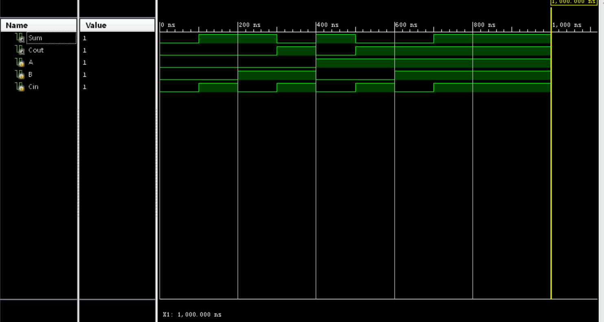

通过观察 ISim 仿真波形，结合一位全加器的理论真值表进行对比分析：

| A | B | Cin | Cout (进位) | Sum (本位和) |
| --- | --- | --- | --- | --- |
| 0 | 0 | 0 | 0 | 0 |
| 0 | 0 | 1 | 0 | 1 |
| 0 | 1 | 0 | 0 | 1 |
| 0 | 1 | 1 | 1 | 0 |
| 1 | 0 | 0 | 0 | 1 |
| 1 | 0 | 1 | 1 | 0 |
| 1 | 1 | 0 | 1 | 0 |
| 1 | 1 | 1 | 1 | 1 |

仿真波形以 100ns 为周期进行状态切换。当输入 A=0, B=1, Cin=1 时，观察到 Sum 为 0，Cout 产生进位 1；当输入 A=1, B=1, Cin=1 时，观察到 Sum 为 1 Cout 为 1。全时段内波形变化与全加器理论逻辑完全吻合，证明代码行为功能正确，没有出现竞争与冒险现象。

### 六、结果说明

硬件测试需配置相应的 UCF 约束文件。根据开发板原理图，将输入输出映射到具体的物理元件及管脚上，并设置电平标准为 LVCMOS33 ：A 分配至 P11 (SW0)，B 分配至 L3 (SW1)，Cin 分配至 K3 (SW2) 。Sum 分配至 M5 (LD0)，Cout 分配至 M11 (LD1) 。


生成 .bit 文件并通过 Adept 下载至 BASYS2 开发板。上电测试后，拨动 SW0、SW1、SW2 开关改变输入状态。经过全面测试，LED 灯的亮灭状态响应与真值表完全对应，硬件电路实现了预期的一位全加器功能。


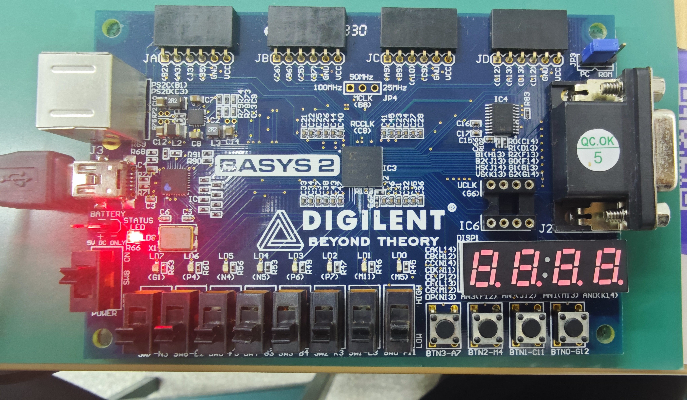

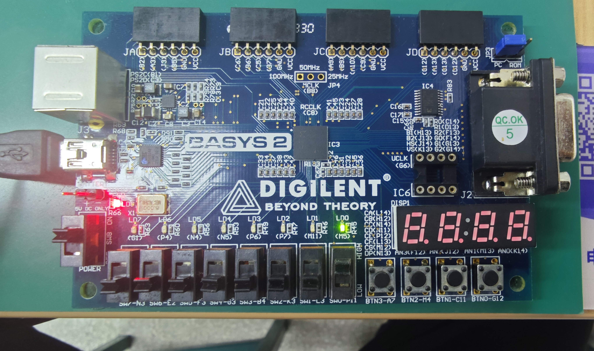

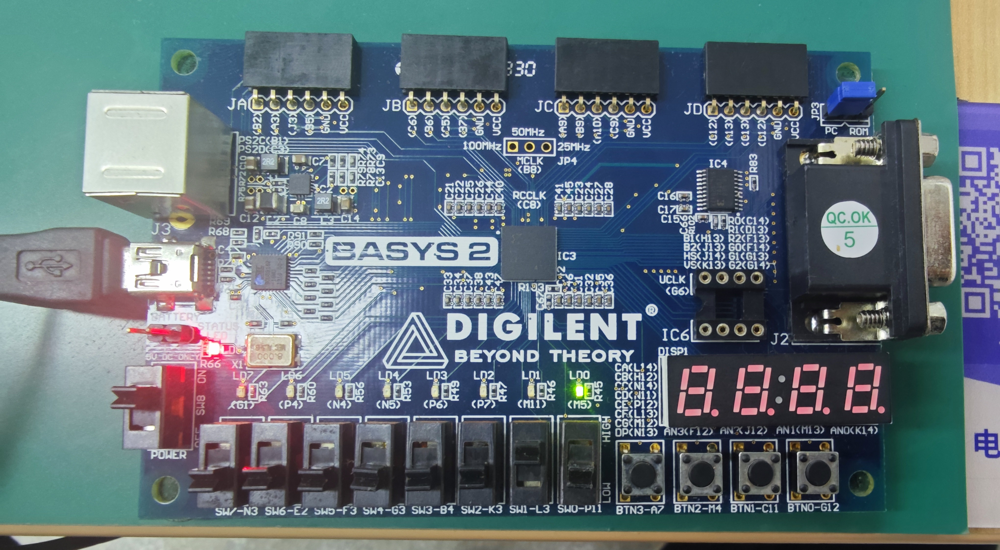

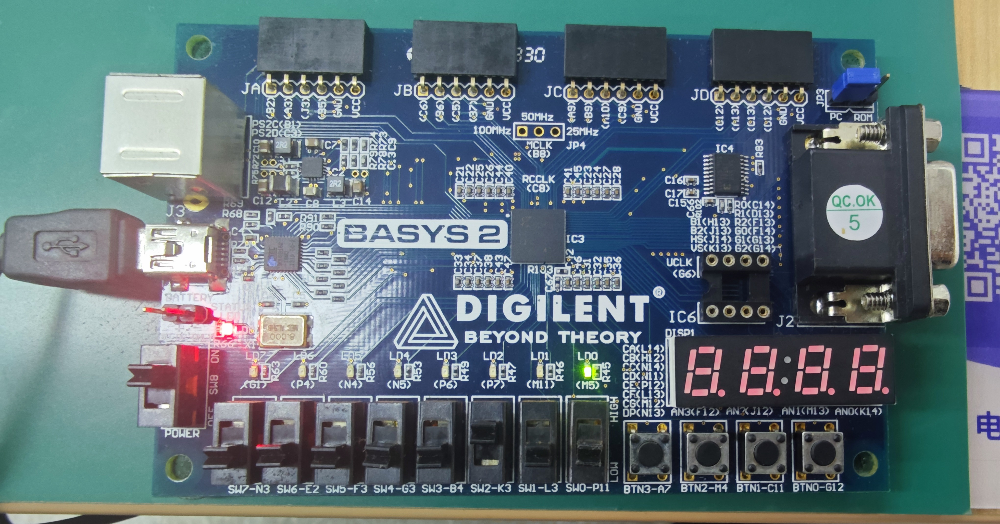

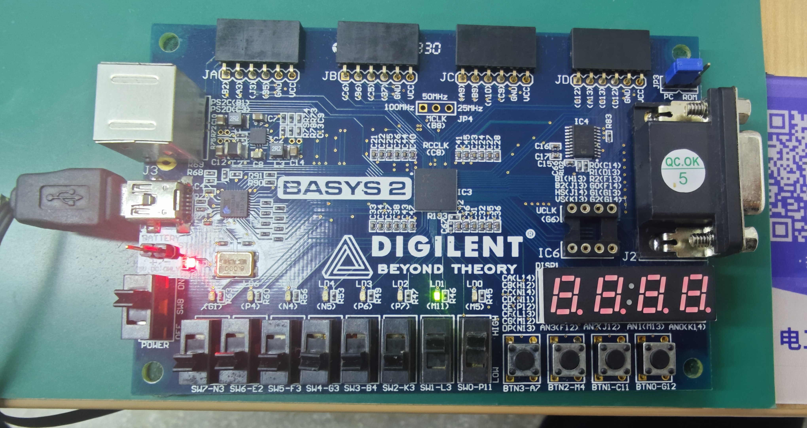

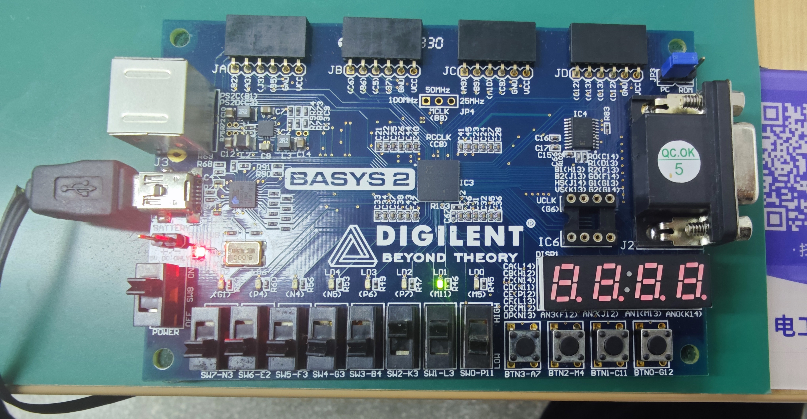

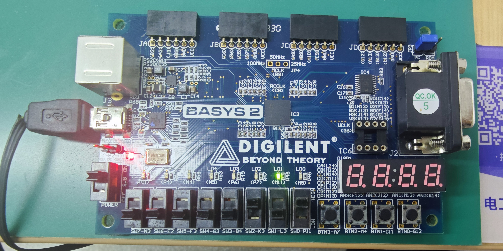

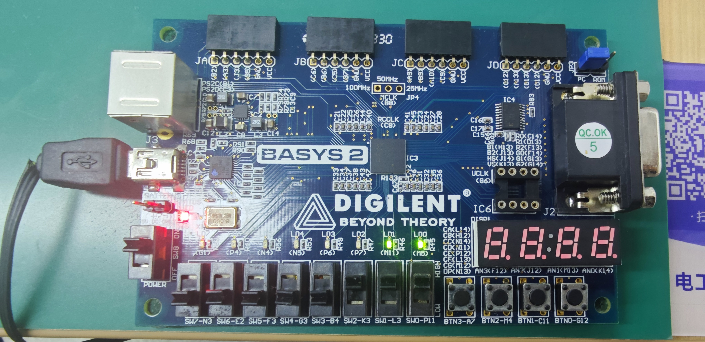

### 六、RTL 级电路图（RTL Schematic）结构分析

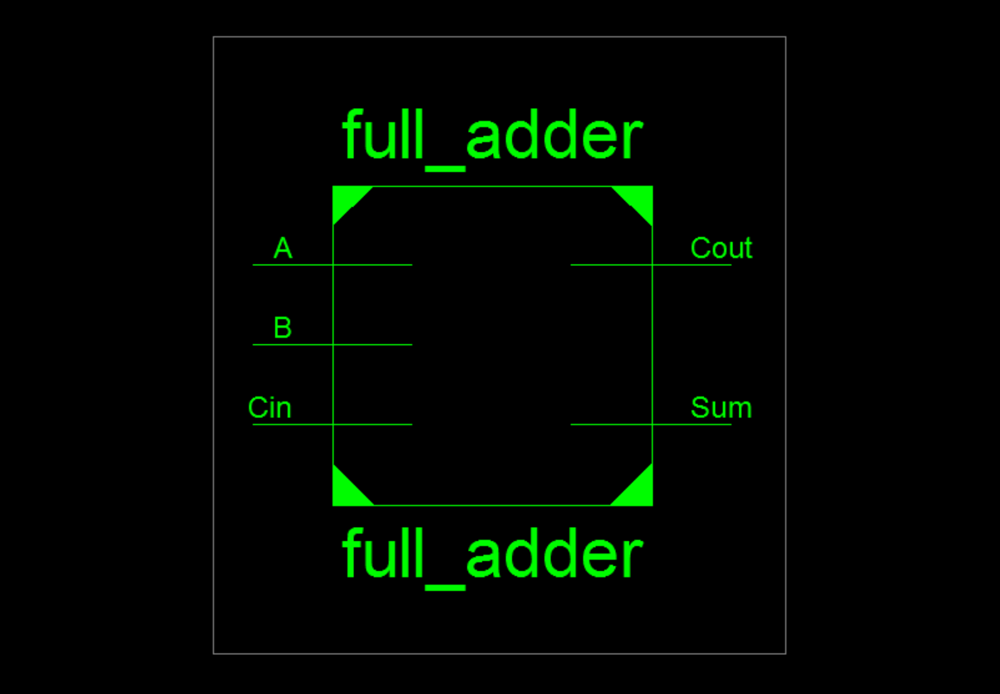

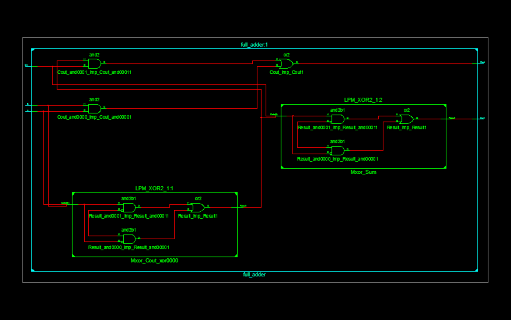

在 Xilinx ISE 中双击“View RTL Schematic”并展开顶层模块后，可以看到综合工具（XST）将编写的数据流代码转化为了由底层基础逻辑门构成的电路结构。结合代码，对该 RTL 视图的分析如下：

`assign Sum = A ^ B ^ Cin; Sum 信号的生成路径由异或门（XOR）级联组成。输入信号 A 和 B 首先进入第一个异或门，计算出半加结果。随后，该中间结果与进位输入 Cin 一同进入第二个异或门，最终得出本位和 Sum。$Sum = A \oplus B \oplus C_{in}$

Cout（进位输出）的生成逻辑:`assign Cout = (A & B) | (Cin & (A ^ B)); Cout 的生成路径结合了与门（AND）、或门（OR）和异或门（XOR），分为两个核心分支。输入 A 和B直接进入一个与门，当 A 和 B 同时为 1 时，必定产生进位。综合工具非常智能地复用了计算Sum时A和B产生的异或结果，将其与Cin一起送入另一个与门。这代表如果 A 和 B 中有一个为 1，且低位有进位Cin输入时，也会向高位传递进位。这两个与门的输出最终进入一个两输入或门，得出最终的进位输出$Cout = (A \cdot B) + (C_{in} \cdot (A \oplus B))$虽然在 RTL 视图中我们看到的是清晰的传统逻辑门（与、或、非、异或），但由于我们的目标芯片是 Spartan-3E 系列 FPGA，这些逻辑门在最终的View Technology Schematic中，并不会以分立门电路的形式存在，而是会被打包映射到 FPGA 底层的查找表LUT中。
由于全加器共有 3 个输入（A, B, Cin）和 2 个输出（Sum, Cout），综合器通常会利用 FPGA 内部的 4 输入 LUT 资源，将上述复杂的逻辑门组合直接优化为底层 LUT 的真值表寻址过程。这种映射方式极大地降低了门延迟，提高了电路的运行速率。

### 七、思考及总结 

在设计全加器时，采用了wire类型声明输出，并使用assign连续赋值语句。这让我更加直观地理解了数据流描述方式 。它不依赖时钟触发，只要等号右侧的信号（A, B, Cin）发生变化，等式左侧的结果就会立即更新，非常贴合组合逻辑硬件的物理特性 。在仿真阶段一切顺利，但在最终烧录下载时，深刻体会到了 UCF 约束文件的作用。只有将代码中的逻辑端口精确绑定到 FPGA 的物理管脚，虚拟的代码才能变成能通过开关和 LED 灯交互的实体电路，这加深了我在系统可编程技术的理解 。
