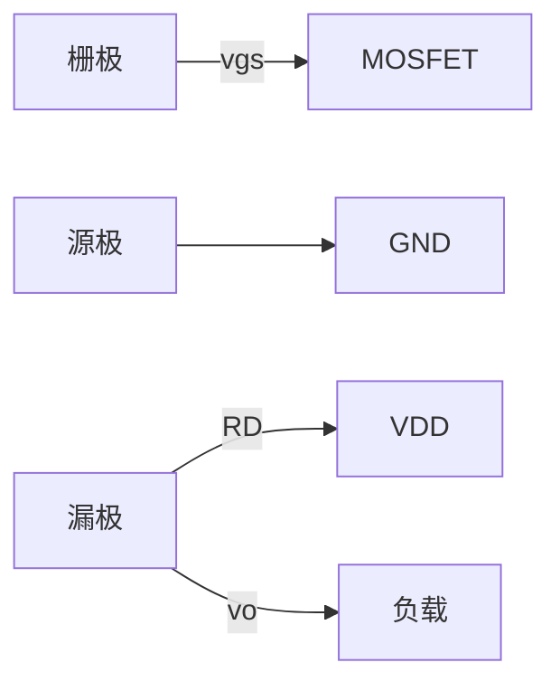
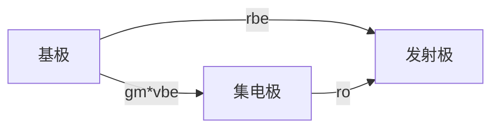
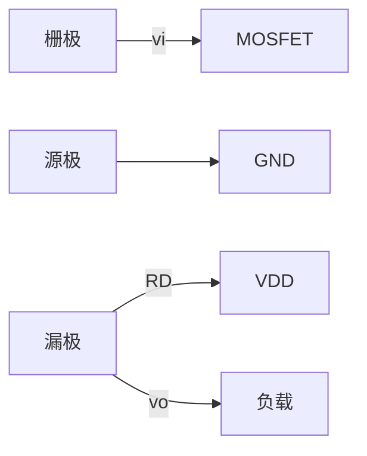
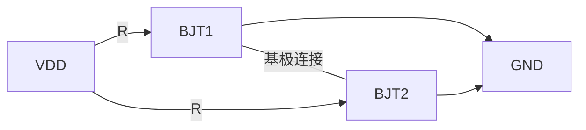
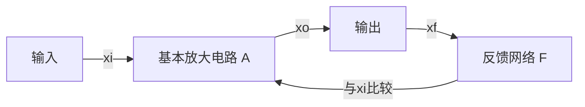
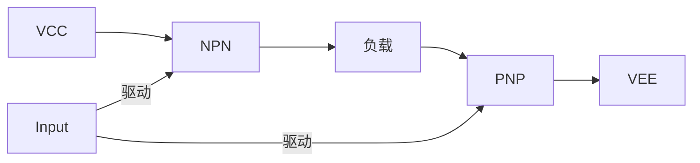
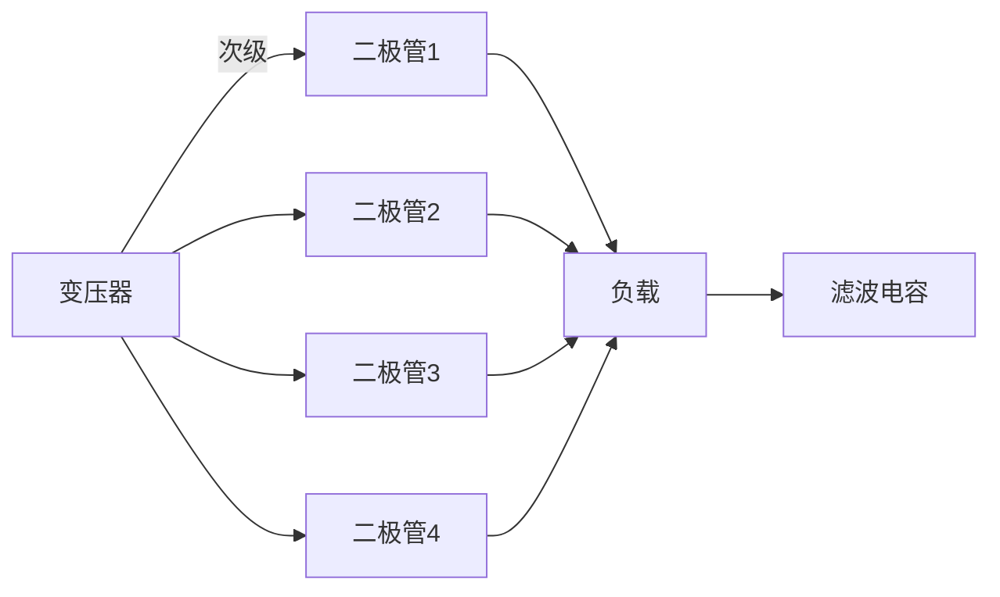
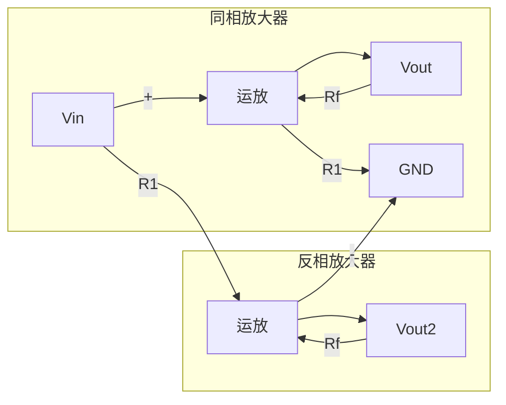

# 《电子技术基础 模拟部分》公式知识点详解

## 1. MOSFET器件模型与参数

### 1.1 肖克利方程

**公式**：
$$i_D = I_S(e^{\frac{v_{GS}}{V_T}} - 1)$$

**知识点**：MOSFET的指数模型，描述栅源电压与漏极电流的关系

**性质**：
- 适用于小信号MOSFET的精确建模
- $I_S$为反向饱和电流，$V_T$为热电压（室温下约26mV）
- 体现MOSFET的非线性特性

**应用电路**：小信号MOSFET放大器、模拟集成电路

---

### 1.2 MOSFET跨导

**公式**：
$$g_m = 2K_n(V_{GSQ}-V_{TN}) = \sqrt{2K_nI_{DQ}}$$

**知识点**：MOSFET的小信号跨导参数

**性质**：
- 表示栅源电压对漏极电流的控制能力
- 与静态工作点相关，$V_{GSQ}$为栅源静态电压，$V_{TN}$为阈值电压
- $K_n = \frac{1}{2}\mu_nC_{ox}\frac{W}{L}$，其中$\mu_n$为电子迁移率，$C_{ox}$为单位面积栅氧化层电容

**应用电路**：

---

### 1.3 MOSFET输出电阻

**公式**：
$$r_{ds} = \frac{1}{\lambda[2K_n(V_{GS}-V_{TN})]} = \frac{1}{\lambda I_D}$$

**知识点**：MOSFET的输出电阻（厄利效应）

**性质**：
- $\lambda$为沟道长度调制系数，反映漏源电压对沟道长度的影响
- 与漏极电流成反比
- 实际MOSFET的输出特性不是理想的水平线，而是略向上倾斜

---

### 1.4 MOSFET静态工作点

**公式**：
$$I_{DO} = \frac{I_D}{2} = V_{TN}^2$$

**知识点**：MOSFET的静态工作点分析

**性质**：用于确定MOSFET放大电路的直流工作点

---

## 2. BJT器件模型与参数

### 2.1 混合π模型参数

**公式**：
$$r_{be} = 200 + (1 + \beta)\frac{26(mV)}{I_{EQ}(mA)}$$

**知识点**：BJT的混合π模型输入电阻

**性质**：
- 反映BJT的输入特性
- 与发射极静态电流$I_{EQ}$成反比
- 200Ω为基区体电阻，26mV为室温热电压

**应用电路**：共射、共基、共集放大电路

---

### 2.2 BJT频率参数

**公式**：
$$f_T = \frac{g_m}{2\pi C_{\pi}}$$

**知识点**：BJT的特征频率

**性质**：
- 表示BJT的高频性能极限
- 超过此频率，BJT失去放大能力
- $C_{\pi}$为基极-发射极电容

---

## 3. 各类放大电路

### 3.1 共源放大电路

**公式**：
$$A_{v} = -g_m(r_{ds}//R_D)$$

**知识点**：MOSFET共源放大电路的电压增益

**性质**：
- 负号表示反相放大
- 电压增益与跨导$g_m$和等效负载电阻成正比
- 高频时因寄生电容影响增益下降

**电路图**：

---

### 3.2 共射放大电路

**公式**：
$$A_{v} = -\beta\frac{R_c}{r_{be}}$$

**知识点**：BJT共射放大电路的电压增益

**性质**：
- 负号表示180°相移
- 增益与电流放大系数$\beta$成正比
- 与输入电阻$r_{be}$成反比

---

### 3.3 差分放大电路

#### 3.3.1 差模电压增益

**公式**：
$$A_{d1} = -\frac{1}{2}g_m(r_{ds}//R_D)$$

**知识点**：差分放大电路单端输出的差模增益

**性质**：
- 负号表示反相
- 与跨导$g_m$和等效负载成正比
- 单端输出增益为双端输出的一半

#### 3.3.2 共模抑制比

**公式**：
$$K_{CMR1} \approx g_mr_o$$

**知识点**：差分放大电路的共模抑制能力

**性质**：
- 衡量电路抑制共模信号的能力
- 与跨导$g_m$和输出电阻$r_o$成正比
- 理想情况下共模增益为零

---

### 3.4 电流镜

**公式**：
$$I_{REF} = I_{DO} + I_{TN}(2)$$

**知识点**：基本电流镜电路

**性质**：
- 用于提供稳定的偏置电流
- $I_{REF}$为参考电流
- $I_{DO}$为输出电流

**电路图**：

---

### 3.5 频率响应

**公式**：
$$f_H = \frac{1}{2\pi R_{si}'C}$$
其中 $C = C_{gs} + (1 + g_mR_L')C_{gd}$，$R_{si}' = R_{si}//R_g$

**知识点**：MOSFET放大电路的上限截止频率

**性质**：
- 受密勒效应影响，$C_{gd}$被放大$(1+g_mR_L')$倍
- 信号源内阻$R_{si}$和栅极电阻$R_g$并联影响高频响应
- 密勒电容是限制高频性能的主要因素

---

## 4. 反馈放大电路

### 4.1 闭环增益

**公式**：
$$A_f = \frac{A}{1 + AF}$$

**知识点**：负反馈放大电路的闭环增益

**性质**：
- $A$为开环增益，$F$为反馈系数
- $1+AF$称为反馈深度
- $AF$称为环路增益
- 负载稳定性和增益精度提高，但增益降低

**电路图**：

---

### 4.2 深度负反馈

**公式**：
$$A_f \approx \frac{1}{F}$$

**知识点**：深度负反馈条件下的闭环增益

**性质**：
- 当$|1+AF| \gg 1$时成立
- 闭环增益仅取决于反馈网络
- 几乎不受晶体管参数分散性影响
- "两虚"特性：虚短和虚断

---

### 4.3 反馈对输入/输出电阻的影响

**串联负反馈输入电阻**：
$$R_{if} = (1 + AF)R_i$$

**并联负反馈输入电阻**：
$$R_{if} = \frac{R_i}{1 + AF}$$

**电压负反馈输出电阻**：
$$R_{of} = \frac{R_o}{1 + AF}$$

**电流负反馈输出电阻**：
$$R_{of} = (1 + AF)R_o$$

**知识点**：负反馈对放大电路输入/输出电阻的影响

**性质**：
- 串联负反馈增大输入电阻
- 并联负反馈减小输入电阻
- 电压负反馈减小输出电阻（稳定输出电压）
- 电流负反馈增大输出电阻（稳定输出电流）

---

### 4.4 环路稳定性

**相位裕度**：
$$\varphi_m = 180^\circ - |\Delta\varphi_a + \Delta\varphi_f| \geq 45^\circ$$

**幅值裕度**：
$$G_m = -20\lg|AF| \geq 10dB$$

**知识点**：负反馈放大电路的稳定性条件

**性质**：
- 防止自激振荡的必要条件
- 相位裕度保证在$|AF|=1$时，总相移小于180°
- 幅值裕度保证在总相移达180°时，$|AF|<1$

---

## 5. 功率放大电路

### 5.1 乙类放大器效率

**最大输出功率**：
$$P_{om} = \frac{V_{CC}^2}{2R_L}$$

**最大效率**：
$$\eta_{max} = \frac{\pi}{4} \approx 78.5\%$$

**知识点**：乙类互补对称功率放大器

**性质**：
- 理想乙类放大器最大效率为78.5%
- 实际效率受饱和压降和交越失真影响
- $V_{CC}$为电源电压，$R_L$为负载电阻

**电路图**：

---

### 5.2 甲乙类偏置

**公式**：
$$V_{BB} = (1.1 \sim 1.2)V_{BE}$$

**知识点**：甲乙类功率放大器的偏置电压

**性质**：
- 消除交越失真
- $V_{BB}$略大于两倍$V_{BE}$
- 通常由二极管或VBE倍增器提供

---

### 5.3 整流滤波

**桥式整流输出电压**：
$$V_o = 0.9V_2$$

**桥式整流输出电流**：
$$I_o = \frac{0.9V_2}{R_L}$$

**知识点**：桥式整流滤波电路

**性质**：
- $V_2$为变压器次级电压有效值
- 0.9系数考虑了全波整流和电容滤波效果
- 适用于线性稳压电源的前端

**电路图**：

---

## 6. 振荡电路

### 6.1 RC振荡器

**公式**：
$$\dot{F} = \frac{1}{3 + j(\omega RC - \frac{1}{\omega RC})}$$

**振荡频率**：
$$\omega_0 = \frac{1}{RC}$$

**知识点**：文氏电桥RC振荡器的反馈系数

**性质**：
- 满足振荡条件$|\dot{A}\dot{F}| \geq 1$且$\angle\dot{A}\dot{F} = 0^\circ$
- 频率稳定度取决于RC元件的精度
- 通常配合非线性稳幅环节使用

---

## 7. 集成运算放大器

### 7.1 虚短虚断

**公式**：
- 虚短：$v_+ = v_-$
- 虚断：$i_+ = i_- = 0$

**知识点**：理想运放的基本假设

**性质**：
- 仅适用于负反馈深度的运放电路
- "虚短"源于高开环增益，"虚断"源于高输入阻抗
- 是分析运放应用电路的基础

### 7.2 同相/反相比例放大

**同相放大**：
$$A_v = 1 + \frac{R_f}{R_1}$$

**反相放大**：
$$A_v = -\frac{R_f}{R_1}$$

**知识点**：基本运放应用电路

**电路图**：

---

## 8. 电流反馈型运放

### 8.1 闭环带宽

**公式**：
$$f_{Hf} = \frac{1}{2\pi R_fC_{eq}}$$

**知识点**：电流反馈型运放的频率特性

**性质**：
- 闭环带宽与反馈电阻$R_f$成反比
- 增益带宽积不为常数
- 高频性能优于电压反馈型运放

---

## 9. 频率补偿技术

### 9.1 密勒补偿

**公式**：
$$C_{eq} = C_c(1 + A_{v2})$$

**知识点**：密勒效应在频率补偿中的应用

**性质**：
- 通过密勒效应将小电容等效为大电容
- 有效降低主极点频率
- 常用于集成运放内部补偿（如741运放）

**电路图**：

---

## 10. 直流偏置与误差分析

### 10.1 运放输入偏置电流影响

**公式**：
$$V_{IO} = \left[\frac{R_2}{R_1}(1 + \frac{R_f}{R_2})I_{B1} - (1 + \frac{R_f}{R_2})I_{B2}\right] + (I_{B2} - I_{B1})R_f$$

**知识点**：运放输入偏置电流引起的输出失调电压

**性质**：
- $I_{B1}$和$I_{B2}$为运放两输入端的偏置电流
- 通过合理选择电阻值可减小偏置电流影响
- $R_2 = R_1//R_f$时可消除偏置电流影响

---

## 11. 稳定性与补偿设计原则

### 11.1 一般频率补偿原则

**准则**：
> 0分贝水平线上增益A的衰减斜率只有-20dB/十倍频

**知识点**：负反馈放大电路的稳定性设计

**性质**：
- 保证相位裕度大于45°
- 通常在主导极点后引入补偿电容
- 通过改变极点位置实现稳定

**补偿方法**：
1. 电容滞后补偿
2. 密勒补偿
3. 零点补偿

---

## 12. 设计指导原则

### 12.1 反馈类型选择原则

| 设计目标 | 应采用的反馈类型 |
|----------|-----------------|
| 稳定直流量 | 直流负反馈 |
| 稳定交流量 | 交流负反馈 |
| 稳定输出电压 | 电压负反馈 |
| 稳定输出电流 | 电流负反馈 |
| 增大输入电阻 | 串联负反馈 |
| 减小输入电阻 | 并联负反馈 |
| 增大输出电阻 | 电流负反馈 |
| 减小输出电阻 | 电压负反馈 |
| 电压→电流转换 | 电流串联负反馈 |
| 电流→电压转换 | 电压并联负反馈 |
| 电压→电压转换 | 电压串联负反馈 |
| 电流→电流转换 | 电流并联负反馈 |

---

## 13. 关键性能指标

### 13.1 环路增益与精度

**相对误差公式**：
$$E_r = \frac{1}{|1+AF|} \times 100\% = \frac{1}{G} \times 100\%$$

**知识点**：深度负反馈条件下的近似计算误差

**性质**：
- 环路增益$G=|AF|$越大，误差越小
- 当$G=100$时，误差约为1%
- 通常要求环路增益大于40dB（100倍）

---

## 14. 实际工程应用注意事项

1. **信号源匹配**：
   - 电压信号源配串联负反馈效果更好
   - 电流信号源配并联负反馈效果更好

2. **频率补偿**：
   - 高速应用需考虑相位裕度
   - 大电容负载需要特殊补偿技术

3. **温度稳定性**：
   - 负反馈可减小温度对增益的影响
   - 需考虑热漂移对直流工作点的影响

4. **电源抑制比(PSRR)**：
   - 负反馈可提高PSRR
   - 通常在两级放大之间加电流源负载

---

## 15. 典型集成运放内部电路

**741运放关键参数**：
- 输入级：差分放大电路
- 中间级：共射放大电路
- 输出级：互补对称电路
- 频率补偿：30pF密勒电容

**公式**：
$$C_{eq} = C_c(1 + A_{v2})$$

**知识点**：集成运放内部频率补偿

**电路特点**：
- 密勒电容连接在高增益两级之间
- 等效电容放大$(1+A_{v2})$倍
- 有效控制主极点位置

---

*注：本总结基于《电子技术基础 模拟部分》教材内容，包含了主要公式及其在模拟电路设计中的应用。实际应用中需考虑工艺偏差、温度影响等实际因素。*